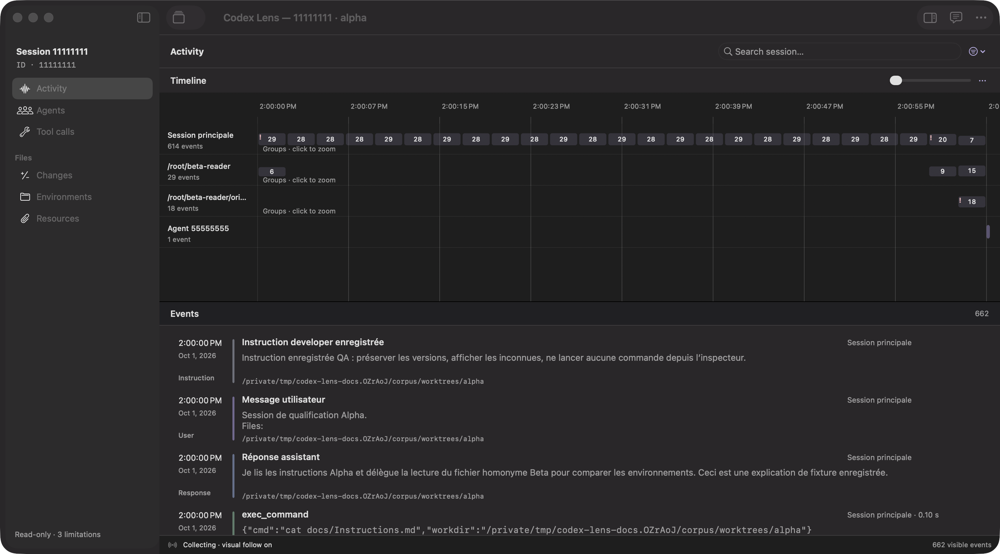
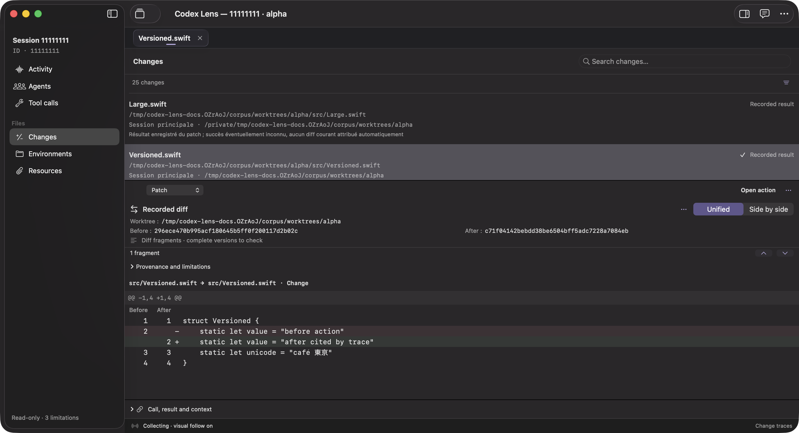

# Codex Lens

[](https://github.com/wolf75222/CodexLens/actions/workflows/ci.yml)

A native macOS app for exploring a Codex session: its activity, agents, tool calls, files, environments, and changes.

Open an existing session, including one still running in Codex, and follow its recorded activity without resuming it. A separate sidebar chat helps you ask questions about selected messages, calls, and file versions.



*Current app screenshots with anonymous test fixtures. No personal conversations or credentials are included. [Capture method and source hashes](docs/images/README.md).*

## Install

1. Download the Apple Silicon disk image from [Releases](https://github.com/wolf75222/CodexLens/releases/latest).
2. Open the `.dmg` and drag **Codex Lens** into **Applications**.
3. Launch Codex Lens and choose a session, paste its ID, or paste a `codex://threads/<thread-id>` link.

Updater-enabled builds offer **Codex Lens → Check for Updates…** and update preferences in **Settings → General**. Future signed releases replace the installed app in place. Older builds need one manual replacement. [Updates and removal](docs/UPDATES.md) describes automatic checks and the optional uninstall/data-cleanup flow.

Release assets include SHA-256 checksums. Current community builds are locally signed, not Developer ID notarized; macOS may require confirmation in **System Settings → Privacy & Security**. Do not disable Gatekeeper.

## Explore, then ask

- **Activity:** navigate a timeline with one lane per agent, grouped events, search, filters, and an equivalent event list. Pause visual following while collection continues.
- **Agents and calls:** trace parent relationships, missions, exchanges, arguments, results, and recorded errors. Reading a call never runs it again.
- **Files and changes:** browse accessible environments, inspect recorded patches, and compare available versions. Every file keeps its worktree identity; current Git changes are shown separately.
- **Resources:** find supplied attachments, referenced files, and recorded reads. Missing content stays marked as missing; a local search can propose candidates without treating them as historical originals.
- **Chat:** use the installed Codex and its ChatGPT connection. Add selected context, continue the conversation, and open cited sources at the versions attached to that response. No API key is required for this mode.



## Requirements and boundaries

| Area | Current scope |
| --- | --- |
| Platform | macOS 14 deployment target; release downloads are for Apple Silicon |
| Native UI | SwiftUI and AppKit; Liquid Glass controls on macOS 26 with fallbacks |
| Language | English and French, selectable in Settings |
| Session inspection | Local persisted Codex data, including separately stored descendants when their relationships are recorded |
| Local Codex chat | App Server adapter qualified for **Codex 0.159.2** and a ChatGPT login; other versions are refused |
| Historical files | Recorded content, verified Git objects, or reconstruction validated against a recorded content hash |

The macOS 14 target is a deployment declaration, not a claim that every feature has been tested on that OS. Intel, every Codex log format, and remote sessions without local traces are not qualified.

Lens reads the observed sources and writes its own cache, preferences, investigation data, and explicitly chosen exports. It does not resume observed threads, execute their tools, install hooks, or edit their repositories. Selecting or previewing content sends nothing to an AI service. Sending a chat message transmits the question, attached context, and conversation to OpenAI through Codex; Settings explains this connection. Codex manages its credentials, and Lens does not copy `auth.json` into its storage.

A path mention does not prove a file was read. A requested patch does not prove it was applied. Missing history does not prove an action did not happen. The app keeps those distinctions visible rather than filling gaps with current files or inferred intent.

## Build and test

Use Xcode with the macOS 26 SDK and Swift 6 or newer. Packaging and local launch helpers use Python 3.11 or later. The package uses Swift 5 language mode and has no remote production SwiftPM dependencies. CI uses the Apple Silicon macOS 26 runner with Xcode 26.6.

```sh
git clone https://github.com/wolf75222/CodexLens.git
cd CodexLens
bash scripts/build.sh
bash scripts/test.sh -c release
```

The build creates `dist/Codex Lens.app` and the `lens-inspect` command-line inspector. To build with symbols for Instruments:

```sh
bash scripts/build.sh --profile
```

To build and package a release disk image, application ZIP, symbols, and checksums:

```sh
bash scripts/package-release.sh
```

CI runs the repository's build and test scripts. Release workflows and their exact status are available in [Actions](https://github.com/wolf75222/CodexLens/actions); a successful build is not a substitute for interactive macOS testing.

## Documentation

- [Feature catalogue](docs/FEATURES.md): detailed functions, entry points, shortcuts, limits, and annotated screenshots.
- [User guide](docs/USER_GUIDE.md): sessions, live following, versions, chat, exports, and keyboard shortcuts.
- [Architecture](docs/ARCHITECTURE.md): data flow, identities, storage limits, and source boundaries.
- [Contributing](CONTRIBUTING.md): local validation and review expectations.
- [Security](SECURITY.md): privacy boundaries and reporting sensitive issues.
- [Changelog](CHANGELOG.md): release changes.
- [Release maintenance](docs/RELEASING.md): changelog entries, version preparation, checks and publication.

Codex Lens is an independent project and is not an official OpenAI app. Product names and visual references do not imply endorsement.

## License

Original Codex Lens code is [MIT licensed](LICENSE). Icon artwork attribution and the separate treatment of product marks are documented in [Third-party notices](THIRD_PARTY_NOTICES.md).
