# Feature catalogue

This is the detailed catalogue of the existing Codex Lens app, reviewed on **2026-10-06** against source commit **`5378bd5`**, app **0.41.0**, build **75**. It describes implemented entry points and the conditions under which their data is available. It is not a roadmap or a claim that every workflow has been retested on every macOS version.

The navigation section also includes the current unreleased workspace-return fixes. Their baseline, verification and separate captures are documented in the [navigation audit](QA/WORKSPACE_NAVIGATION.md).

The current unreleased **session curves** are described separately below and in their [model and verification notes](QA/SESSION_CURVES.md).

The images show native macOS windows from an isolated QA app with anonymous session data. New captures in `images/features/` use CUA's native-window screenshot API; earlier images retain their documented capture methods. See the [capture notes](images/features/README.md) for methods and provenance. Recorded fixture text keeps its original language; some macOS-owned menus may be French. The chat image shows a prepared, unsent question. No personal account identity or live model answer is shown.

For a shorter walkthrough, see the [User guide](USER_GUIDE.md). For module and data-flow details, see [Architecture](ARCHITECTURE.md).

## Contents

- [Platform and operating model](#platform-and-operating-model)
- [First use and opening sessions](#first-use-and-opening-sessions)
- [Activity timeline, event list, and filters](#activity-timeline-event-list-and-filters)
- [Session curves](#session-curves)
- [Live following and previews](#live-following-and-previews)
- [Agents and their instructions](#agents-and-their-instructions)
- [Tool-call inspection and long output](#tool-call-inspection-and-long-output)
- [Compaction and context measurements](#compaction-and-context-measurements)
- [Communications between agents](#communications-between-agents)
- [Environments, files, and local search](#environments-files-and-local-search)
- [Resources and missing attachments](#resources-and-missing-attachments)
- [Changes, diffs, and historical versions](#changes-diffs-and-historical-versions)
- [Origin and associated instructions](#origin-and-associated-instructions)
- [Linked navigation, tabs, bookmarks, and panels](#linked-navigation-tabs-bookmarks-and-panels)
- [Investigation chat](#investigation-chat)
- [Conversation review and export](#conversation-review-and-export)
- [Investigation archives](#investigation-archives)
- [Settings and personalization](#settings-and-personalization)
- [Native menus and keyboard commands](#native-menus-and-keyboard-commands)
- [Help and onboarding](#help-and-onboarding)
- [Coverage, privacy, and storage boundaries](#coverage-privacy-and-storage-boundaries)
- [Developer tools](#developer-tools)
- [Capabilities that are not available](#capabilities-that-are-not-available)

## Platform and operating model

| Feature | Available behavior | Condition or boundary |
| --- | --- | --- |
| Native macOS application | SwiftUI navigation, AppKit readers, menus, window integration, PDFKit previews, and system SQLite | No Electron, Tauri, WebView, or custom GPU renderer |
| Deployment target | macOS 14 | The declared target is not qualification of every workflow on that OS |
| Distributed architecture | Apple Silicon | Intel is not a qualified release target |
| Interface languages | English, French, or system-selected language | Source conversations, code, and typed questions are not translated |
| Session-centric inspection | One observed session and its associated descendants, resources, and environments | Sharing a repository does not establish a session relationship |
| Existing and active sessions | Read available history, then collect new persisted events | Opening does not resume, interrupt, or instrument the observed Codex process |
| Separate investigation | A sidebar chat attached to selected session context | The chat has its own owned thread; it is not the observed session |
| Local collection | Read-only Codex records and accessible local files | In-memory-only activity, deleted history, and inaccessible remote logs cannot be recovered by display alone |

Inspection actions never rerun a recorded tool or apply a recorded patch. Current files, recorded content, and verified historical versions retain different labels and identities.

## First use and opening sessions

Entry points: **File → Open Session…**, the toolbar's session action, **Command-O**, or the empty-window action.

| Feature | How it works | Condition or limit |
| --- | --- | --- |
| Optional introduction | Three steps introduce a session, the timeline, and the sidebar chat | Skip is available; the guide can be replayed without resetting the observed session |
| Session catalogue | Search and select locally available session summaries | A summary is not a guarantee that every descendant or source file remains readable |
| Agent information | Inspect recorded role, available description, configured model/effort, requested spawn settings and original tasks/instructions | Requests remain distinct from recorded thread data. Child attribution needs explicit IDs; current definitions do not fill historical gaps. [Data boundaries](QA/AGENT_METADATA.md) |
| Validated catalogue cache | Reuse compact first-record metadata in memory and after restart; refresh titles and relations from current sources | File identity, nanosecond modification/change times, size, mode and cloud flags validate hits; new/deleted files and investigation exclusions are checked on each scan. No prompt or transcript bodies are cached here |
| ID input | Paste a complete session or thread UUID | Turn IDs and call IDs are not interchangeable with session IDs |
| Codex link input | Paste `codex://threads/<thread-id>` | The recognized route resolves the UUID; it does not launch or resume that thread in Codex |
| Archived sessions | Existing archived local sessions can be discovered | The underlying local records must remain accessible |
| Descendant catalogue option | Include subagents and continuations in the picker | This changes visible catalogue choices, not evidence of parentage |
| Session selection | Single click selects; double-click or the Open action opens | Return uses the valid input/selection target rather than a guessed unrelated session |
| Source location | The picker displays the Codex directory being consulted | “My Codex sessions” appears when this differs from the personal source |
| Refresh | Reload the available session catalogue | No Codex session is started |
| Row context menu | Open session, copy its ID, or copy its initial directory | An absent initial directory cannot be copied as if known |
| Loading and cancellation | Native bars show the current phase immediately, aggregate known history bytes, work remaining and current file counters; opening steps expand on demand | Counts belong to their phase, not estimated duration. Linking, view preparation and exports report measured work where available. Unknown totals remain indeterminate. Refresh preserves existing rows; cancellation retains the previously opened session. [Progress behavior](QA/LOADING_PROGRESS.md) |
| Opening failure | Show the error while preserving the existing session | An ambiguous session-to-thread mapping requires the exact thread ID |

The catalogue displays a session's title, identifier, date, and initial directory when recorded. Long paths and titles retain full text through tooltips or copy actions.

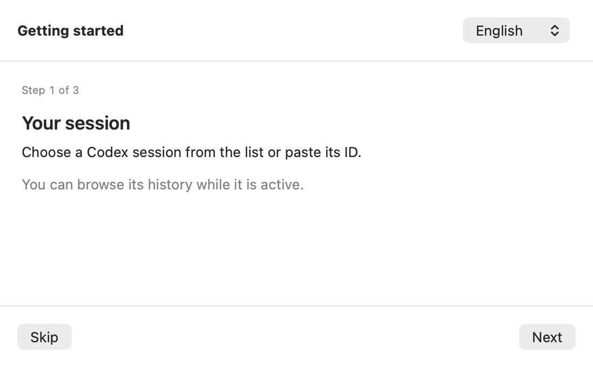

*The introduction explains one task at a time. Skip leaves the user free to explore; Next advances without opening or changing a Codex session.*

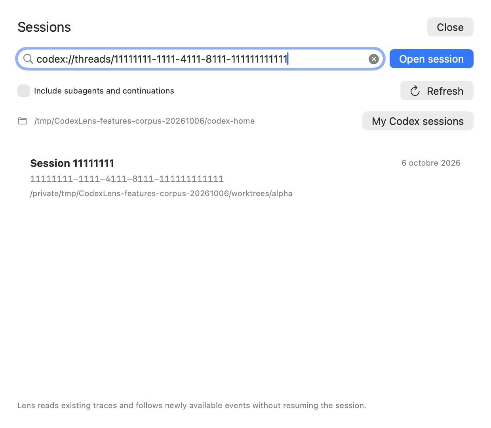

*The search accepts a title, ID, or Codex thread link. The source directory identifies which local catalogue is being searched; the list supplies the exact opening target.*

Source: [session picker and window](../Sources/CodexLens/MainView.swift), [input-target parsing](../Sources/LensCore/SessionPickerTarget.swift).

## Activity timeline, event list, and filters

Entry point: **Activity** in the sidebar or **Command-1**. The timeline, list, and inspector use the same event selection.

| Feature | Available behavior | Condition or limit |
| --- | --- | --- |
| Agent lanes | One chronological lane per agent | Unresolved identities remain unresolved rather than merged by repository |
| Recorded event types | User/assistant messages, instructions, calls/results, delegation, waits, errors, lifecycle, context, compaction, and unknown records | Not every log version supplies every type |
| Event selection | Click selects. Timeline double-click/Return frames; event-list double-click/Return opens a tab; Command-Return opens a timeline event in a tab | Overlapping marks may need disambiguation |
| Event context menu | Open in Tab, open agent/environment, copy event ID/internal link, or prepare a question | Actions capture the selected event identity |
| Timeline/list linking | An event opened elsewhere can be shown and framed in the timeline | Framing is a reading/navigation action, not evidence of causality |
| Density grouping | Separated events keep individual colored marks; dense groups retain their event-type colors | Colored group portions describe exact type counts, not a sequence of actions; individual records stay available in the event list |
| Group zoom | Clicking a group narrows the time scale; zooming out restores grouping | Grouping changes presentation, not source records |
| Zoom and pan | Timeline keyboard zoom, pinch when enabled, and horizontal movement | Zoom shortcuts follow focus and the configured behavior |
| Frame selection | Timeline menu → Frame | Requires an event selection |
| All-time view | Timeline menu → Show All | Resets the viewport, not the stored event history |
| Event list | A native, virtualized list complements the graphical timeline | Lists expose individual records even when the timeline groups them |
| Keyboard selection | Arrow/Option-Arrow keys, Home/End, Return/Command-Return, and context-menu commands | Availability follows the current focused view |
| Session search | Search the recorded event content, not just visible row previews | Reads are incremental and cancellable; changed sources are reported |
| Filters | Agent, environment, resource, event type, selected period, and associated instruction | Filters remain visible/removable and survive live arrivals |
| Time period | Drag on the ruler, Option-drag on the timeline, or use the Period dialog's start/end date controls | Calls that overlap the period can be included even if they start earlier |
| Ask about a period | Add the selected period to a question | This prepares bounded context; it does not send the question |
| Reset filters | **Shift-Command-R** or the filter action | In Agents, the same command clears agent search instead |
| Timeline visibility | Show/hide the graphical chronology while keeping the list | Does not stop collection |
| Timeline guide | Timeline menu → Reading guide | Explains gestures and selection without adding another data dashboard |

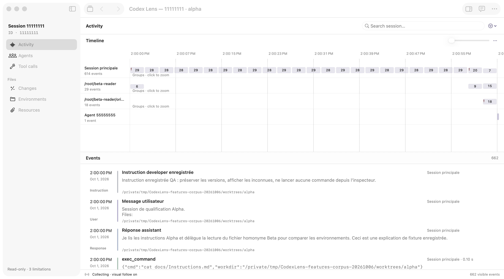

*The lanes expose parallel activity, while the list gives each message or call an individual opening target. Selection links those two representations to the inspector.*

Source: [activity views and native timeline](../Sources/CodexLens/ActivityView.swift), [timeline model](../Sources/LensCore/TimelineModel.swift), [filter/search area](../Sources/CodexLens/MainView.swift).

## Session curves

Entry point: **Activity → Charts**, in the shared activity view picker. This is another view of the session's recorded history, with the existing filters.

Choose a metric, then **Per interval** or **Cumulative**. Select an interval in the chart or reveal the values table with its table icon. **View activity** opens that period in the existing chronology; toolbar **Back** returns to the chart's metric, counting mode and selected period. The graph does not open a separate analytics window.

| Feature | Available behavior | Boundary |
| --- | --- | --- |
| Shared activity scope | Session, agent, environment, event type, search and period filters also apply to Charts | Changing the metric does not change the session being inspected |
| Metrics | Events, tool calls, MCP calls, requested file changes, reported errors, recorded waits and identified compactions | Counts describe recorded items, not productivity, time spent or causal influence |
| Per-interval and cumulative counts | Native Swift Charts zero-based columns or cumulative steps, with UTC-aligned intervals and local-time labels | Cumulative counts include the filtered, dated records only; they are not context-token usage |
| Call identities | Count a recorded invocation once; a mirrored result does not add another call | Identical call IDs from different agents are kept separate |
| MCP classification | Count explicit qualified MCP tool names | A mention in a shell command or JavaScript source is not another captured call |
| Requested file changes | A file target counts per logical patch call and environment | Same relative paths in two worktrees stay distinct; a request does not establish application |
| Reported errors | Associate known failure records with their call when identifiers allow it | A completion failure uses its recorded end time; an unknown completion time is not replaced by the call start |
| Waits and compactions | Count recorded waits and canonical compaction operations | No idle-time estimate, compression ratio or extra compaction for each mirrored representation |
| Period inspection | Select a point or table row, then View activity; Back restores the chart state | The timeline opens the period's context, including overlapping recorded calls |
| Values table | Show or hide a resizable native table of periods, interval counts and cumulative counts | It provides a textual alternative to the graph; scrolling qualification is detailed in the audit |
| Keyboard navigation | Left/Right selects chart intervals; native table arrows change the shared selection; Return or a table-row double-click opens activity | These actions need focus in the chart or table; hardware trackpad and VoiceOver qualification are separate |
| Bounded rendering | At most 240 plotted intervals; metadata aggregation runs in the presentation actor | Every associated source ID stays available; a bounded graph is not source truncation |
| Missing data and coverage | Undated items are counted separately; collection limits remain accessible below the chart | Empty intervals do not establish inactivity or complete observation |
| Empty and updating states | No-dated-data guidance and a preparation indicator use the existing activity scope | An empty plot does not silently create timestamps for undated records |

The [curve audit](QA/SESSION_CURVES.md) distinguishes counting regressions, native-view checks and actual app-window inspection, including the remaining interaction limits.

*Choose the metric at the upper left and interval/cumulative mode at the upper right. The selected period and highlighted values row agree; the footer keeps undated items and collection limits visible. This is the final palette's frozen development-source capture, identified in the [capture notes](images/curves/README.md).*

*The dark view retains MCP calls, cumulative mode, the values panel and 14:01:03–14:01:04. Selected controls use the same violet family, and the active row adds an edge marker. This visual check is separate from the native navigation tests and Back-return replay; the [curve audit](QA/SESSION_CURVES.md) records their respective source identities and an isolated unexplained state change.*

Source: [curve model](../Sources/LensCore/SessionTrends.swift), [native chart](../Sources/CodexLens/SessionTrendsView.swift), [values table](../Sources/CodexLens/SessionTrendValuesTable.swift), [presentation preparation](../Sources/LensCore/SessionPresentation.swift).

## Live following and previews

Entry points: the session menu → **Show live timeline**, **Navigation → Show live timeline**, or **Option-Command-L**. Visual following toggles with **Shift-Command-L**.

- A moving timeline remains above the central preview or open reading tabs.
- Choose a **1-, 5-, or 15-minute** live window.
- Select a recent event to preview its content without removing the live timeline.
- Open the latest event, return to the list, or open the latest recorded diff from the live controls.
- A preview can follow related call/result or change links.
- **Open in Tab** promotes the preview to a reading tab for continued inspection.
- The preview menu exposes provenance and prepared questions; it never reruns the action.
- Zooming, panning, or inspecting the past pauses visual following. Collection continues and pending arrivals are counted.
- **Return to Live/Present** publishes arrivals and recenters the live window.
- The live timeline and preview split is vertically resizable.
- Existing filters and selected periods still affect the displayed records; their presence is shown rather than silently removed.

Live diffs refer to recorded change sources. They are not screen recordings, filesystem snapshots at every keystroke, or automatic attribution of all current worktree changes.

The clock can advance without a new persisted event. Its movement does not establish that an agent process is still active. New-source polling is approximately every **two seconds**, with additional time needed for indexing and UI publication.

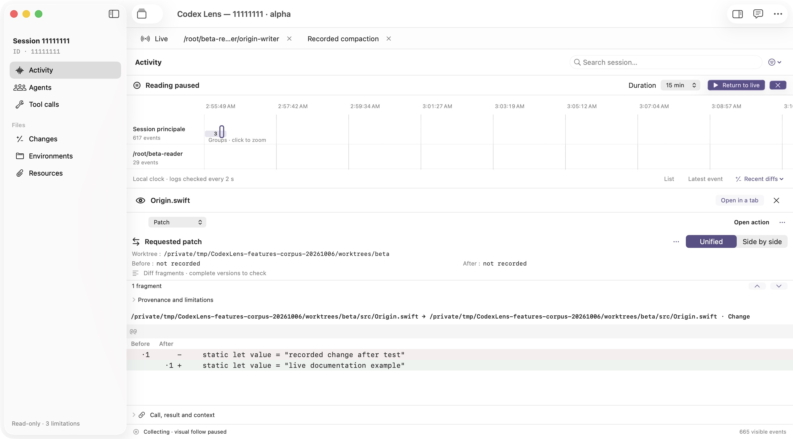

*The upper region retains recent synthetic activity while visual following is paused for reading; collection continues. The lower region shows the requested patch and its missing full-version labels. These demonstration records were appended to the disposable fixture, without executing a patch. Open in Tab preserves the live overview.*

Source: [live timeline and preview](../Sources/CodexLens/LensLiveTimeline.swift), [live state](../Sources/LensCore/TimelineLiveState.swift).

## Agents and their instructions

Entry point: **Agents** or **Command-2**; an event's agent link and Quick Access also open the corresponding agent.

| Feature | What is shown or reachable | Boundary |
| --- | --- | --- |
| Agent tree | Root, subagent, fork, continuation, or unknown relationship | Relations use recorded metadata/delegation, not shared directory alone |
| Agent identity | Name/path, ID, parent, recorded mission, activity, and associated environments | Missing mission or parent information stays missing |
| Separately stored histories | Descendant activity from its own accessible journal | Inaccessible descendants remain identified as unavailable |
| Agent search | Search identity, mission, and supported traces | Failure and no-match states provide retry/reset rather than hiding the issue |
| Detail opening | Double-click, Return, or Open in Tab | Does not start or resume the agent |
| Activity filtering | “Filter its activity” narrows the timeline/list | Uses the selected agent ID |
| Instruction history | Recorded direct instructions, inherited-context records, and subsequent corrections | Presence does not establish understanding or application |
| Parent navigation | Open parent and related mission/instruction events | Missing steps remain explicitly unresolved |
| Question preparation | Add agent context or prepare a question | No automatic send |

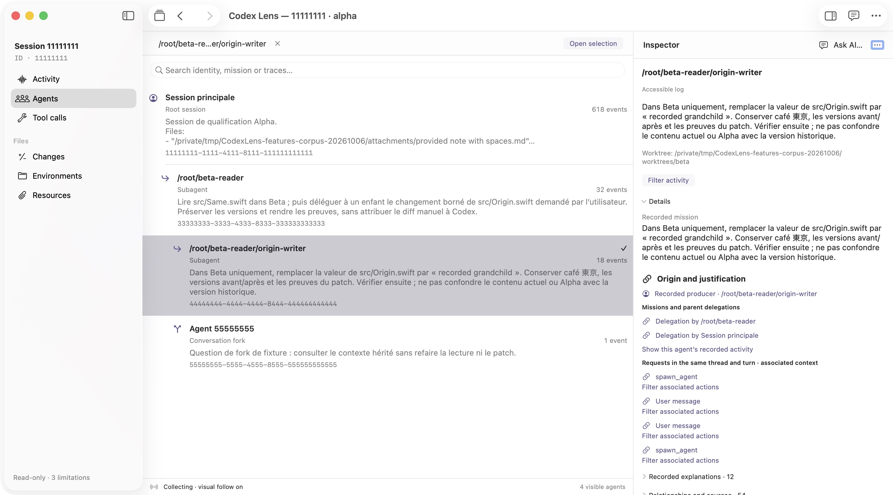

*The agent list distinguishes relationship types. The selected agent's details link its mission and environments to the same objects used by activity and changes.*

Source: [agent views](../Sources/CodexLens/ObjectViews.swift), [instruction details](../Sources/CodexLens/ContextEvidenceViews.swift).

## Tool-call inspection and long output

Entry point: **Tool Calls** or **Command-3**, an activity event, a change's linked action, or a communication link.

| Feature | Available behavior | Condition or limit |
| --- | --- | --- |
| Recorded tools | Inspect shell commands, patches, searches, MCP calls, delegations, and supported Code Mode wrappers | Only recorded calls are available; wrapper text is never evaluated |
| Call metadata | Tool name, agent, arguments, IDs, execution directory, timestamps, duration, status, and known error | Absent duration/identifiers are not guessed |
| Content selector | Content, Input, Output, Raw | Source format determines which fields exist |
| Linked results | Open recorded result and related request independently | An unpaired result remains visible without a fabricated request |
| Progressive output | Load More reads additional content; complete/partial state and byte count are visible | No silent truncation presented as full output |
| Multiple sources | Expand Sources to inspect each path, line, byte interval, and field-presence state | Supplementary representations are not automatically identical |
| Live source changes | Explicitly reload newly linked traces | Current reading is not overwritten by every arrival |
| Copy loaded text | Copy the currently loaded portion | Clearly different from a complete-section copy |
| Complete copy | Read and validate the available section or one chosen trace before updating clipboard | Cancellable, 32 MiB maximum; source mutation fails explicitly |
| Recorded Markdown | Read supported formatted content or switch to original text | Large/unsupported formatting uses a visible original-text fallback |
| Missing output | Distinguish empty recorded text, absent field, inaccessible source, and read error | None is replaced with a summary or rerun |

Expandable **Outputs, Tests and Observations** adds these source-dependent views:

- Captured command-output fields versus recorded tool-result fields, their byte counts, and explicit truncation markers. A captured output is not automatically confirmed as included in a model request.
- Recognized test commands with execution traces, recorded outcomes, and later changes in the same environment. The first 12 later-change links are displayed, with remaining changes accessible in Changes; their presence does not establish which revision the test covered.
- Calls with the same arguments and environment, linked as observed repetitions rather than diagnosed failures. The detail initially links up to 8 repeated events; the rest stay accessible through search/filters.
- Recorded read-version references and file activity ordered by agent/action; further actions load in groups of 12. Up to 12 read links are shown in this detail, with further reads reachable through resource/activity navigation.
- Overlapping recorded intervals, without claiming that the actual edited bytes overlapped or that a race occurred.

Raw views and copy actions mask recognized secrets. Their output is therefore not a byte-identical forensic export of the original journal.

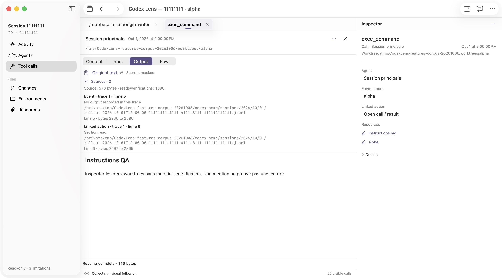

*The selector chooses a recorded field. Sources exposes its journal coordinates; the footer states whether reading is complete or further pages remain.*

Source: [inspector and recorded reader](../Sources/CodexLens/InspectorView.swift), [document paging](../Sources/LensCore/RecordedDocumentPager.swift).

## Compaction and context measurements

Entry points: an indexed **Compaction** event in Activity, the compaction event-type filter, or the Compactions count in View and filters.

- Select a compaction using the same event reader and inspector as other activity.
- Inspect its thread/agent association, known operation IDs, sources, timestamp/bounds, visibility state, and limits.
- Supported multiple source representations can be associated with the same operation instead of counted as separate compactions.
- Persisted supported PreCompact/PostCompact records can contribute their bounds; Lens does not install hooks or invoke a compaction to obtain them.
- Distinguish accessible retained text, an opaque representation, missing data, and absence of a visible match.
- **Compare** expands before/after data that is available, with missing measurements named explicitly.
- Navigate to the first recorded following action; this is journal order, not an asserted causal consequence.
- Add compaction context to a question without triggering compaction in Codex.
- Usage details can show cumulative consumption, a request total, the last measurement, a context estimate, and a reported model context-window size when present.

The UI displays usage values as details. **It does not currently render token/context curves**, compute memory-quality scores, or calculate a compression ratio from noncomparable bounds. A complete pre-compaction context is not established merely by the journal adapter. “Not found in visible text” does not mean the model forgot it.

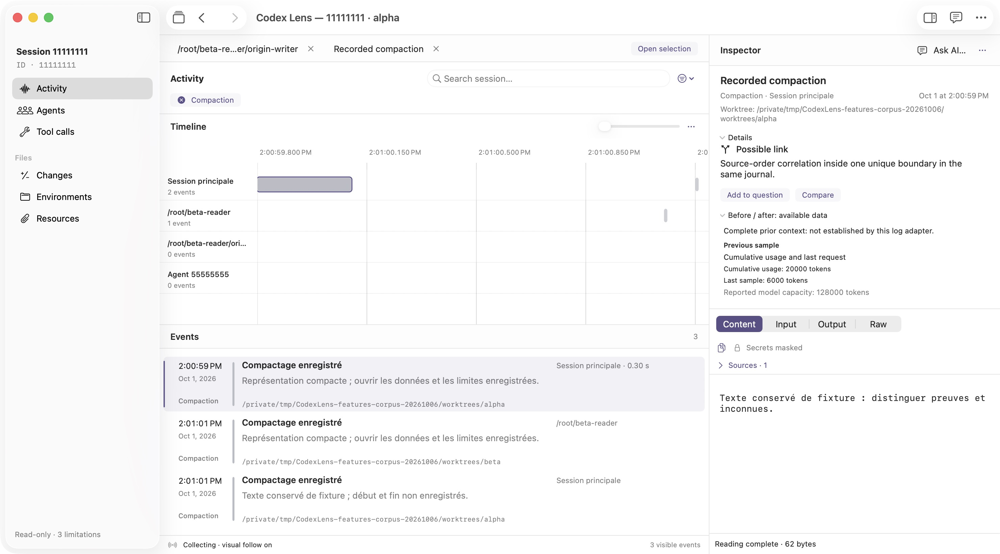

*The selected operation opens its recorded context data. Comparison and source details disclose missing bounds and opaque content rather than inventing a compacted summary.*

Source: [context/compaction inspector](../Sources/CodexLens/ContextEvidenceViews.swift), [context inspection model](../Sources/LensCore/ContextInspection.swift).

## Communications between agents

Entry point: **Activity → View and filters → Communications**. Select a route to use the common inspector; event/delegation details offer corresponding links.

| Feature | Available behavior | Boundary |
| --- | --- | --- |
| Sequence view | Agent columns and recorded message/delegation/follow-up/result/wait routes | This is a linked record view, not a live messaging client |
| Sender/recipient | Open known agent identities and associated events | Unknown identities remain unresolved |
| Communication states | Requested send, tool result, accepted submission, recipient-context trace, and confirmed model inclusion | Receipt, inclusion, understanding, and application are different claims |
| Original message | Open its recorded text or opaque/missing state | Messages are not decrypted or reconstructed by guesswork |
| Context links | Follow origin, related activity, or the recipient agent's recorded changes | Temporal proximity is not enough to establish a message caused a change |
| Context actions | Add to Question, Show in Timeline, Copy Internal Link | No message is sent to an observed agent |
| Coverage | Expand collection limitations and unresolved-lane counts | Grouped unresolved identities retain their inspector details |

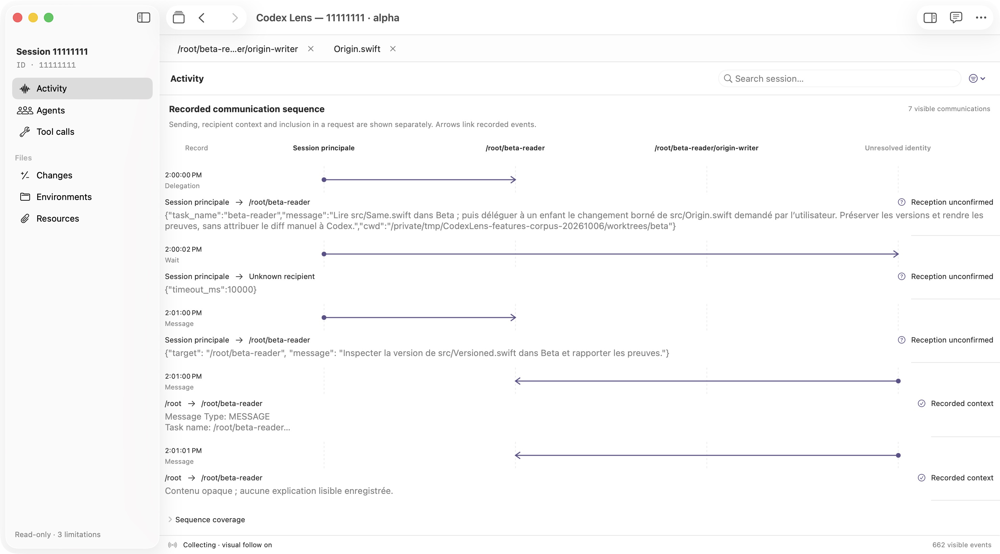

*Columns identify agents and routes link recorded communication events. Status text separates an observed send from recipient context and confirmed model inclusion.*

Source: [sequence view](../Sources/CodexLens/CommunicationSequenceView.swift), [communication details](../Sources/CodexLens/ContextEvidenceViews.swift).

## Environments, files, and local search

Entry point: **Environments** or **Command-4**. Calls, changes, agents, and resources also link their recorded environments.

| Feature | Available behavior | Boundary |
| --- | --- | --- |
| Environment collection | Explore recorded execution directories, repositories, and worktrees across the session family | Not restricted to the root session's initial repository |
| Git identity | Recorded branch/reference and separately inspected current Git identity | Current metadata is not represented as historical metadata |
| Environment activity | Filter activity by this environment and open associated agents | A relative path alone is not a file identity |
| Accessible tree | Expand directories and open files beyond only modified paths | Missing directories retain references but not invented contents |
| Current Git diff | Read current working-tree or staged/index changes with reference/date labels | Not automatically attributed to Codex; untracked files are outside that diff |
| Local file search | Literal, case-insensitive search of current text; open result line/column/version | Current search is not a recorded past read by Codex; case sensitivity is a backend option, not an exposed UI setting |
| Search cancellation | Cancel or replace obsolete search tasks | Changed-file results are rejected rather than opened under their old search version |
| Search limits | Default 5,000 files, 1,000 directories, depth 64, 64 MiB total text, 4 MiB/file, 1,000 occurrences | Limits and inaccessible/binary/restricted entries are reported; these budgets are not editable in the UI |
| Path traversal | Directory symlinks and `.git` are not recursively searched | Avoids presenting an unlimited whole-disk scanner |

The environment's tree/document split is resizable, with a compact file-browser presentation at narrow widths. Listing a very large directory can still require materializing its entries before a bounded search proceeds.

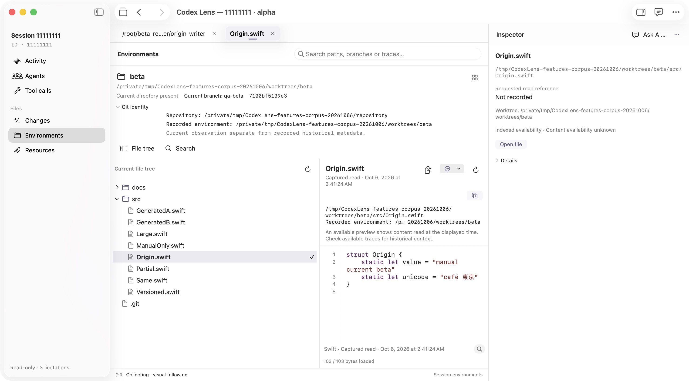

*The environment identifies the repository/worktree before browsing. Tree selection opens files in that environment, including files with no recorded modification.*

The code reader supplies a read-only native text surface with:

- Logical line numbers, gutter selection, requested-line navigation, and a missing-line notice.
- Selectable/copyable text and native Find/Next/Previous (**Command-F**, **Command-G**, **Shift-Command-G**).
- Lexical highlighting for Swift, C/C++/Objective-C, Python, JavaScript/TypeScript, Rust, Go, shell, JSON, YAML/TOML/config formats; unsupported text remains readable.
- Code-font and text-size preferences, plus pinch reading zoom when enabled.
- Current-read/version metadata and an identifier-copy action.
- Progressive local reading with Load More.
- A verified Git snapshot/current-read switch when a recorded reference resolves to accessible Git content.
- Ask AI about the explicitly selected excerpt, without editing or executing it.
- Current-file actions: copy absolute/worktree-relative path and file:line, reveal in Finder, open with a compatible application.

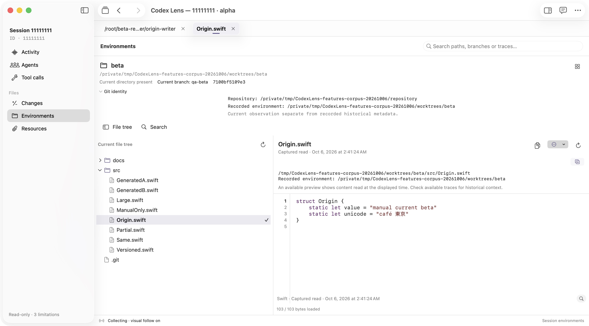

*The gutter refers to the loaded document. The version label identifies the content being read; external-file actions explicitly target the current local file.*

Source: [environment and file views](../Sources/CodexLens/ObjectViews.swift), [code reader](../Sources/CodexLens/CodeDocumentView.swift), [environment search](../Sources/CodexLens/EnvironmentSearchView.swift).

## Resources and missing attachments

Entry point: **Resources** or **Command-5**, or a linked message/call resource.

| Feature | Available behavior | Boundary |
| --- | --- | --- |
| Resource library | Search/filter resource identity and role; open associated context | A referenced location does not ensure the bytes exist |
| Role distinctions | Supplied, referenced, recorded read, modified, produced | A path mention is not promoted to a recorded read |
| Provenance | Originating/using events, environment, availability, and limitations | Supported traces may not identify every producer or consumer |
| Preview | Local text/code, images, PDFs, and supported embedded recorded images | Remote resources are not downloaded automatically; large-image previews may be downsampled and retain that indication |
| Embedded recorded image | Preview supported image data from its originating event even without a local file path | Limited to supported embedded forms and accessible recorded bytes |
| Missing resource | Keep the original reference and explain availability | Current content is not substituted under a past attachment label |
| Recovery entry | Find File… for a missing local attachment | Optional and user-initiated, not an automatic disk crawl |

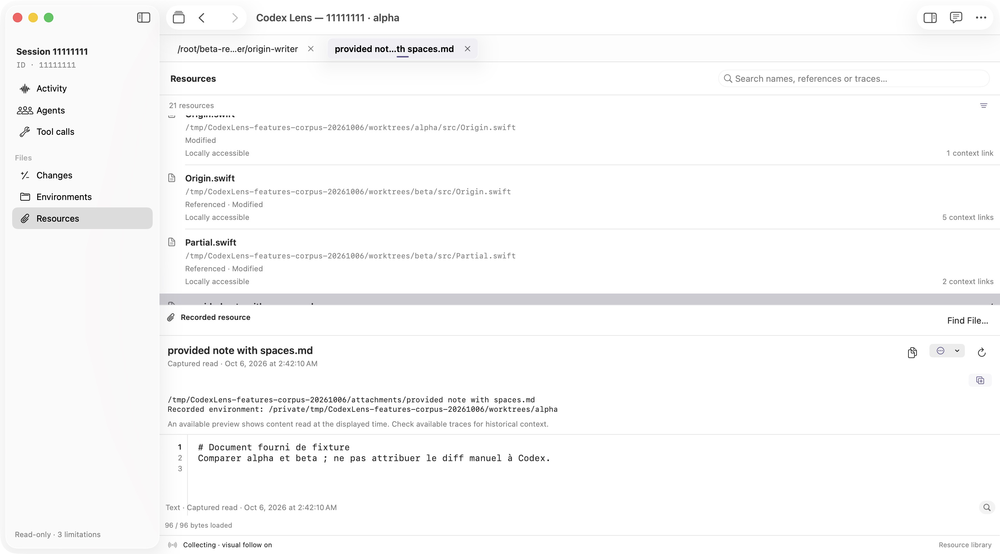

*Resource roles distinguish supplied content from references and recorded reads. Opening the associated event returns to the message or call that introduced the item.*

Recovery offers specific folders, enable/disable folder choices, Add Folder, Search These Folders, Choose File, and Cancel. Candidate rows show name, path, byte count, modification time, observation time, confidence, and the SHA-256 observed during the search. Copy path/hash and Open This Local Version are available.

The recovery search is bounded to **12,000 entries, 4 seconds, and 96 MiB read**. Links, recognized authentication paths, and nonresident cloud content are excluded. Coverage names skipped or unavailable candidates.

**The current recovery UI does not supply a recorded original hash to the service.** Its filename-based candidates and current hashes do not confirm attachment identity. The lower-level service can compare a supplied digest, but that is not an automatic UI capability. A recovered preview is labelled as content observed now, and users can return to the original reference.

There is no Time Machine/backup search or automatic reconstruction of old attachment versions. Make cloud content available explicitly in Finder before retrying.

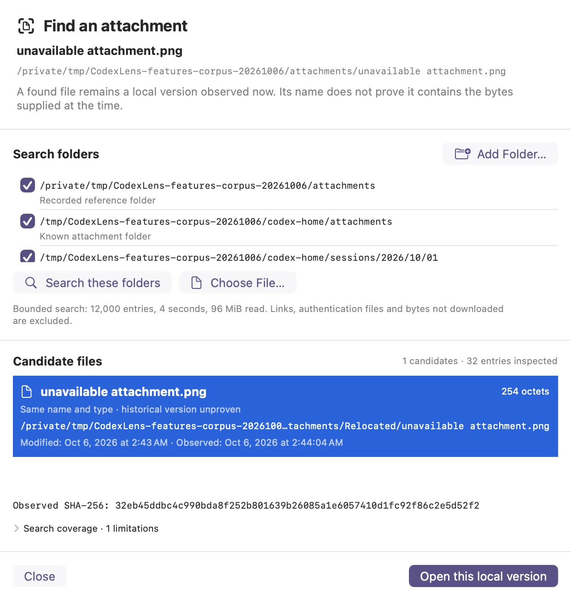

*Folder controls scope the search. This capture shows one filename-only candidate from a deliberate copy in the disposable corpus, its observed SHA-256, and a missing-root coverage limit. The candidate is not an identified original; opening it does not change the original attachment's historical availability.*

Source: [resource views](../Sources/CodexLens/ObjectViews.swift), [recovery UI](../Sources/CodexLens/ResourceRecoveryView.swift), [recovered preview](../Sources/CodexLens/RecoveredResourcePreview.swift).

## Changes, diffs, and historical versions

Entry point: **Changes** or **Command-6**, a recorded call's changes, or a live-diff preview.

### Worktree overview

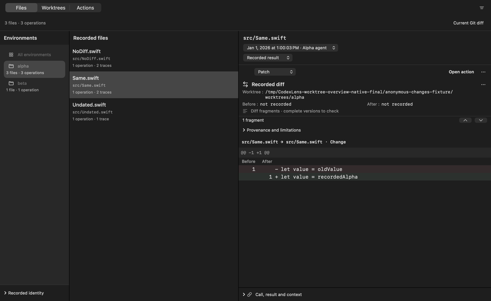

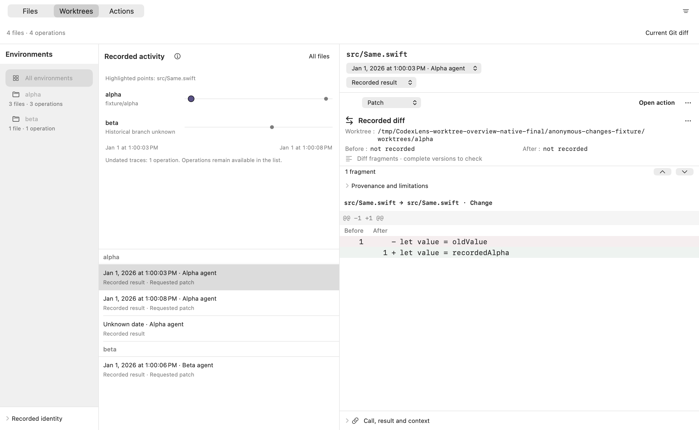

These anonymous fixtures are native AppKit component bitmap captures. Their [manifest](images/changes-overview/capture-manifest.json) records the source hashes and capture limits; they are not screenshots of personal sessions.

**Files** groups changed files by their exact environment. Choose **Files** for a PR-style file list or **Worktrees** for parallel activity lanes. Selecting a file or a point opens its original activity and recorded diff; grouped points list every included operation. **Actions** keeps the individual trace list available.

Requests and linked tool results are one activity, with their traces available separately. The overview does not compose an invented final patch, add unrelated worktrees together, infer Git ancestry or date a worktree's creation from its first recorded operation. Recorded branch/reference fields remain available in the identity disclosure; undated operations remain in the list.

**Current Git diff** is an explicit read of the selected environment. Its options include staged changes or comparison from the recorded full commit, which includes later committed and tracked working-file changes. The comparison labels its current observation and excludes untracked files; it does not reconstruct earlier uncommitted content or attribute current edits to Codex. An unavailable recorded commit stays an error.

Preparation reuses the session's indexed facts outside SwiftUI. Graph marks are bounded to 160 bins per lane, with all constituent operations accessible. The layout adapts between three panes, two panes and a vertical split; Back and reading tabs retain the overview selection.

| Feature | Available behavior | Boundary |
| --- | --- | --- |
| Change collection | Inspect/filter changes by file, agent, environment, period, and trace kind | The collector creates requested-patch and recorded-result rows; current filesystem/Git changes remain separate |
| Native diff | More (…) menu → Unified or Side by side | Before/after columns are version coordinates, not duplicate copies of one line number |
| File/hunk navigation | Select a file/fragment and move through recorded hunks | Partial patches can only offer fragment-local coordinates |
| Version header | Worktree, repository, compared references, trace kind, and known availability | The missing full version is not guessed from its patch |
| Multiple diff sources | Select the recorded diff representation | A result lacking a diff is not silently filled using request text |
| Selected-line context | Open line provenance, source action, agent/mission, environment, and instructions | Does not establish a complete block's lifetime |
| Copy | Selected line, before/after references, and complete source input/output/raw where accessible | Complete-source copy retains limits and validation |
| Current-file integration | Reveal in Finder, open current file with an app, copy its path | External opening is current content, not the historical version displayed |
| Action/result context | Open the linked request and full recorded result | Reported success is not a full-file snapshot |
| Question preparation | Explain change, trace origin, or add fragment/context | Editable preparation; no automatic send |

An **Observed Change** type exists in the model/filter, but this collector does not create production rows of that type. It must not be read as automatic monitoring of manual edits or as a claim that every requested patch became an observed filesystem change.

*The header names the worktree and comparison. Removed and added lines keep their before/after coordinates; action/context navigation reads the recorded request and result separately.*

The content selector provides **Patch**, **Before**, **After**, **Compare**, and **Git Reference**. Missing data produces a labelled unavailable state. Full historical content is available from a recorded full blob, a verified Git object, or a reconstruction whose resulting hash matches a recorded target. Reconstruction is in memory and never applies a patch in the worktree.

**Git Reference** opens the environment's recorded committed baseline when resolvable. It is deliberately separate from the action's Before/After versions: the recorded commit does not establish the uncommitted file state at that action's time.

A verified content version does not prove that Codex applied the action or that the repository had no uncommitted edits at that moment. Missing Git objects, partial patches, unavailable references, failed/refused actions, and empty-file/absent-file states are distinguished.

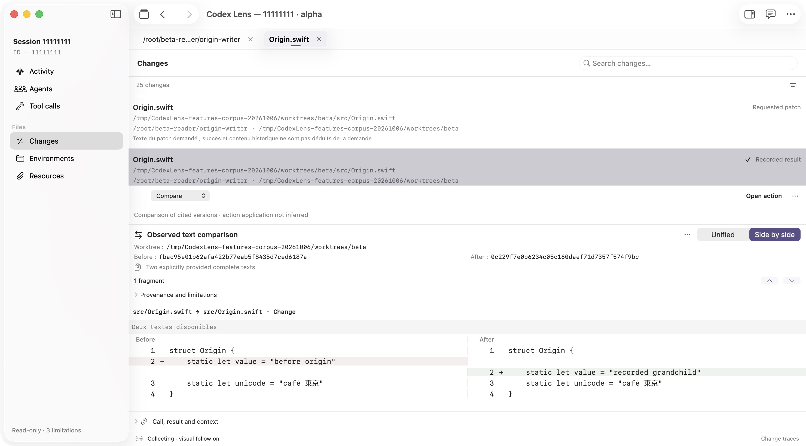

*Compare shows the verified cited Git blobs side by side. The version controls open that content rather than today's file; object/base identifiers describe verification, while action execution and authorship remain separate.*

Source: [recorded diff](../Sources/CodexLens/RecordedDiffView.swift), [historical version viewer](../Sources/CodexLens/RecordedFileVersionsView.swift), [version model](../Sources/LensCore/RecordedFileVersion.swift).

## Origin and associated instructions

Entry points: a diff line's **Origin and Justification** menu, its line-provenance area, or the common inspector's **Details**.

- Follow a change to its recorded call/result, agent, mission, parent, and available instructions.
- Open the user request, turn-associated instruction, delegation message, or agent explanation when recorded.
- Distinguish explicit links, contextual associations, exposed explanations, and unknown steps.
- View direct instructions, inherited-context records, and later corrections separately.
- Keep original explanation text and distinguish absent, empty, opaque, and accessible content.
- Open recorded plans, agent messages, and exposed reasoning summaries/text when present; previews identify their bounds and open the original progressively. An exposed summary is not an exhaustive transcript of private reasoning.
- Filter activity by an associated instruction and navigate back to the same selected action; open its linked changes from the contribution list.
- Expand same-file/worktree contributions and recorded test-verification links when available, retaining their source relation and coverage limits.
- Prepare questions about explaining a change, tracing its origin, comparing an instruction to actions, or examining a justification where the corresponding context action is provided.

The chain is an investigation aid, not an invented account of the model's private reasoning. A shared turn, nearby date, or similar text does not establish causality or application. When links are missing, the chain stops or labels that gap.

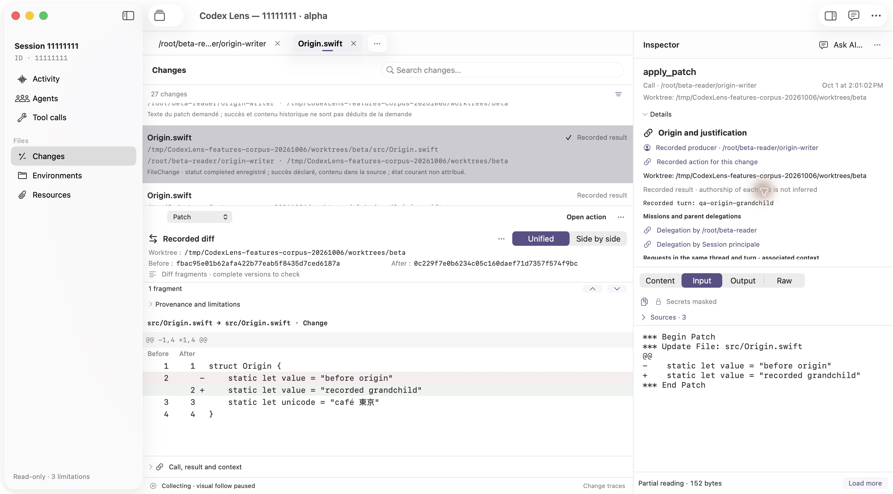

*The chain exposes links to source records. Missing or contextual relationships retain their own labels, so opening an instruction does not imply that it caused the change.*

Source: [origin views](../Sources/CodexLens/OriginEvidenceView.swift), [origin model](../Sources/LensCore/OriginInspection.swift).

## Linked navigation, tabs, bookmarks, and panels

| Feature | Entry point or behavior | Boundary |
| --- | --- | --- |
| Selection history | Toolbar Back/Forward; Command-[ / Command-]; native horizontal swipe | Scoped to the current window; restores selection, filters, timeline framing and event-list scroll anchor |
| Reading tabs | Open Selection, double-click/Return, or Open in Tab | Tabs are app destinations, not native macOS window tab groups |
| Collection return | Activity, Calls, or the originating collection remains beside reading tabs | Closing the last reader restores the collection; ordinary row selection does not retarget explicit tabs |
| Tab overflow | One menu exposes all tabs; active tab stays visible | Does not require a wide horizontal scrollbar |
| Pin/close tab | Tab context menu and close control | Pinning is distinct from bookmarking |
| Tab cycling | Control-Tab / Shift-Control-Tab; Window → Window Tabs | Includes the collection and its readers; works with one reader |
| Bookmarks | Shift-Command-D or a context action; session menu → Bookmarks | Stored destinations keep their session identity |
| Internal links | Shift-Command-C or context menu | Source/version references are included where supported; a link cannot restore deleted bytes by itself |
| Quick Access | Session menu → Agents/Environments | Menu lists are bounded; All Agents/Environments opens the complete corresponding view |
| Inspector/chat | Option-Command-I / Option-Command-C | They share the optional right pane; they are not two simultaneous independent sidebars |
| Panel sizing | Drag native split dividers; Option-Command-Left/Right | Keyboard resize follows the focused pane and its minimum/maximum |
| Region focus | Option-Command-1…4 | Sidebar, content, inspector, chat respectively; hidden auxiliary regions can be opened |
| New windows | Command-N; context menu/File → Open in a new window for a selected item | Each window owns navigation/selection; a selected-item window uses the same observed source and full destination/version identity. Accessible journals are required |

Source: [tabs](../Sources/CodexLens/LensWorkspaceTabs.swift), [window/pane integration](../Sources/CodexLens/LensMacIntegration.swift), [navigation state](../Sources/CodexLens/LensStore.swift).

## Investigation chat

Entry points: the chat toolbar action, **Option-Command-C**, **Command-7**, or **Ask AI…/Add to Question** on a selected object.

### Local Codex connection

- Detects the installed Codex at chat/AI-settings opening and checks account metadata without sending a message.
- The qualified adapter accepts **Codex 0.159.2 or 0.160.1** with **ChatGPT authentication**; an API-authenticated or signed-out account is not silently accepted as the requested personal connection.
- Codex manages its own credentials. Lens does not read/copy `auth.json`, export tokens, alter global Codex configuration, or log out the shared CLI.
- Settings → AI offers automatic discovery or a native installed-binary chooser, Verify/Refresh, verification cancellation, and reported engine/version/path.
- A signed-out state offers Open Codex, or copies `codex login` if no containing app is identified. Copying does not execute the command.
- Model selection uses the reported catalogue; stored unavailable models require an explicit selection rather than automatic replacement.
- The chat composer and AI settings show reasoning effort beside the model. Levels and the default come from that model’s Codex catalogue; a disabled control names missing capability metadata.
- Effort preferences are kept per model. Each send freezes an explicit choice or the advertised default and passes it to the owned chat turn. A saved level that disappears from the catalogue blocks sending until another level is selected; Lens never rewrites global Codex settings.
- Reported plan/rate-limit data is shown only when available. Account connection, catalogue availability, and completed model access are separate states.
- Group Investigations in Codex creates a section for new investigation chats before sending; existing user moves or renames are respected.

### Questions, replies, and attached context

| Feature | Available behavior | Boundary |
| --- | --- | --- |
| Conversation | Ask a question and follow up in the same owned investigation thread | Never targets the observed session or “last session” |
| New chat | Header action begins another chat while retaining previous local records | Disabled during sending/preparation |
| No-selection question | Ask with conversation context only | The entire observed session is not implicitly attached |
| Attach selection | Paperclip or context menu adds events, calls, files, excerpts, changes, agents, or available instructions | Preparation is local and sends nothing |
| Prepared prompts | Explain context, compare versions, inspect associated instructions, or identify missing information | Prompts remain editable and require explicit Send |
| Context tray | Piece count, version/environment, capture time, text/encoded bytes, omitted elements, and JSON view | Per-send context is immutable; later activity cannot replace prior versions |
| Remove/undo source | Remove a draft item, then undo its removal | Undo restores captured content without reading today's file |
| Source actions | Open captured element, copy its text/link, or open originating event | Uses its source identity and version |
| Send | Return/numpad Enter or Command-Return; Shift-Return adds newline | Composition and unavailable connection/model states prevent accidental sending |
| Stop | Interrupt reception while retaining question/context and any partial response | Interruption/EOF/error is not successful completion |
| Draft persistence | Save state indicator, local records, reopening archives | Storage is bounded; no automatic inference retry |
| Transcript history | Previous exchanges, Load Older Exchanges, timestamps, and unavailable-archive states | Missing saved exchanges remain named as unavailable |
| Scroll behavior | Latest Message action; explicit Send scrolls once | Streaming does not continually steal the reading position |
| Citations | Open valid internal source IDs and reuse a source in a follow-up | Unknown IDs have no fabricated link; an address match does not validate the model's interpretation |

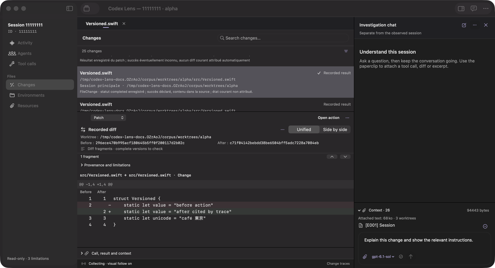

*The central object remains visible beside the chat. The attached-context tray names what will be included; the draft and Send control are separate from context preparation. This illustration does not show a live inference result.*

### Message presentation

Responses support Markdown headings, paragraphs, emphasis, nested ordered/unordered lists, quotations, tables, rules, links, and fenced code. Code blocks are left-aligned, scrollable, selectable, and copyable, with an optional language label and **excerpt-relative** line numbers.

Right-click a message to copy the response, switch raw text/Markdown, copy one or a chosen code block, or open a cited source. Sent-context and cited-source sections are expandable, with Add to Next Question actions. External links open only after explicit click; remote Markdown images are not automatically downloaded.

Formatting is bounded to **512 KiB of source, 10,000 blocks, and 50,000 formatted runs**. This parser limit is separate from the **128 KiB received-answer text budget** and is not a promise that live responses can reach 512 KiB. Oversized formatting falls back to original text rather than disappearing. Streaming text remains labelled in progress/partial until the correct turn finishes successfully.

### Explicit advanced connection options

**Configure Sending…** also contains an independent ChatGPT authorization path and a dedicated OpenAI API path. These controls are present, but they are **unqualified advanced paths**, not a replacement for the verified personal local-Codex workflow.

- Independent authorization requires Lens-specific plan eligibility and a returned authorized model catalogue. Do not assume a CLI login grants it.
- Dedicated API accepts an explicit in-memory key/model and provides Clear Key. It may be billed separately; the key is not persisted by the control.
- Neither is a silent fallback when local Codex fails, and choosing it sends no question automatically.

Source: [chat and context tray](../Sources/CodexLens/InvestigationView.swift), [local connection UI](../Sources/CodexLens/CodexLocalConnectionView.swift), [Markdown](../Sources/CodexLens/LensChatMarkdownView.swift), [message context menu](../Sources/CodexLens/LensChatMessageMenu.swift).

## Changed-file tree

The changes overview groups changed files by worktree and folder in a native outline, beside the selected recorded diff. The pane is on the right, resizable and hideable; compact windows place it below the reading area. Worktree Activity keeps its graph above the diff in the reading pane.

- Use arrow keys to move, expand and collapse folders. Folder navigation retains the open diff.
- Filter by file, folder, full recorded path or worktree label; this filter leaves session filters and the selected diff intact.
- Reveal the selected file explicitly. Live publication preserves expansion and viewport instead of scrolling automatically.
- Copy a recorded path or open the current file from the contextual menu.
- Per-window state and copied navigation checkpoints retain the tree context through Back/Forward and hide/show.

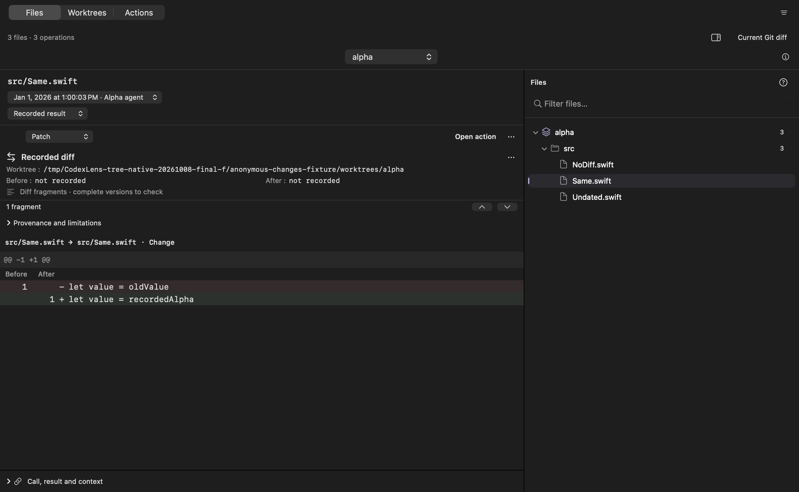

*Anonymous fixture, actual production views captured offscreen from NSHostingView. The production entry point is replaced; this does not qualify the compositor or physical input.*

Only retained changed-file projections populate the tree. It is not a scan of the current repository. Outside-worktree paths remain explicitly grouped; identical paths in different worktrees keep distinct identities. No Git A/M/D status or net diff is inferred from recorded patches.

## Conversation review and export

Preparation and JSON/Markdown export show phase-local message counts and the
remaining work. Saving finishes after the atomic destination commit. Cancelled
or failed exports do not report a saved file.

Entry point: **File → Conversation and Guidance…**, the session menu, or **Option-Command-E**.

- Freeze a collection cut for reviewing the **main thread's user and assistant messages**; the live observer continues separately.
- Browse messages in order, choose **All Messages**, **User**, or **Steering Cues** filters, and search their previews.
- Preview search is limited to **400 characters per message**; this is not the session-wide full-source search.
- Read the selected available message content, its source/role/date, and any lexical guidance markers.
- Markers identify textual indications of correction, preference, constraint, or continuation; they are observations, not a definitive interpretation of intent.
- Reveal Message returns to its source event; Add to Question captures the message for an unsent chat question.
- Export available message text to **JSON** or **Markdown** through a native save panel.
- Preparation/read/export errors have retry or cancellation states; the target stays tied to the frozen cut.
- Missing, partial, historical-source, and coverage limitations remain part of the review/export metadata.

The export service has a **256 MiB total text budget** and a **64 MiB per-message budget**. Over-budget/unavailable texts have explicit statuses; attachment references are exported as references, not guaranteed embedded attachment bytes. The collection cut is a set of recorded source observations, not an atomic snapshot of every process/filesystem.

This is not a complete session-family backup: tools, developer/system instructions, and descendant conversations remain in their existing inspection views rather than being silently included in the main-thread conversation export.

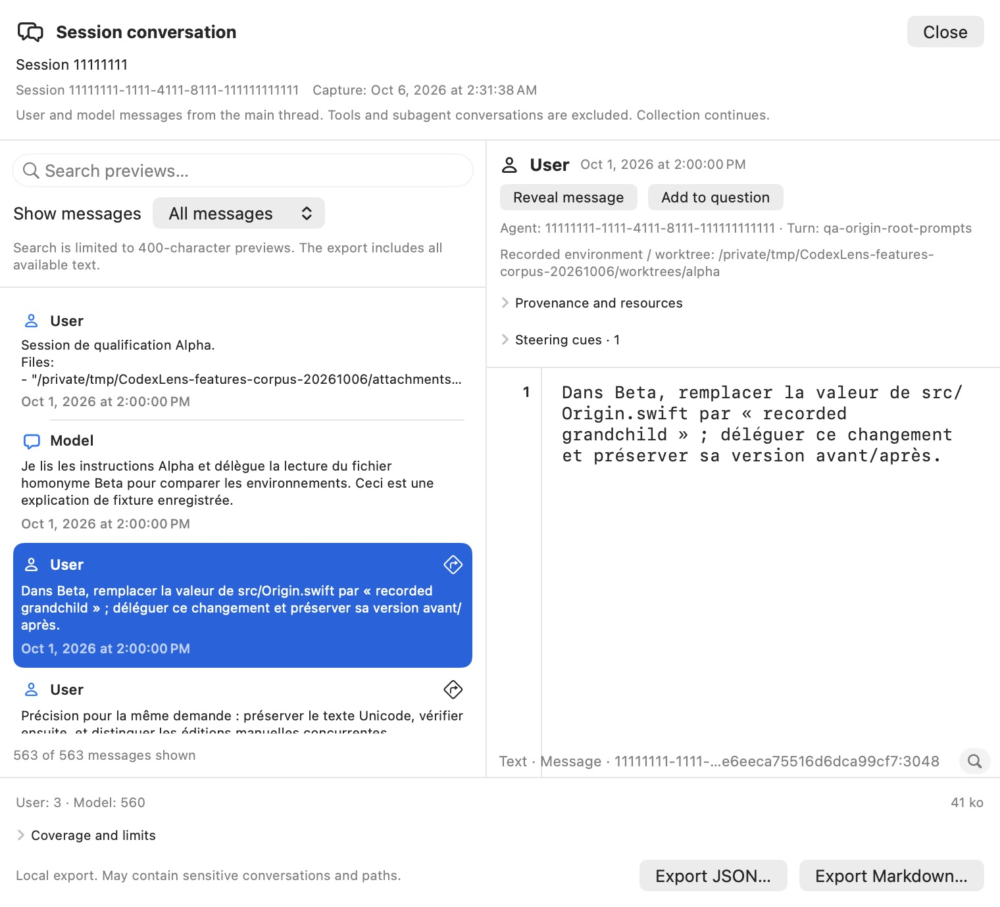

*The list selects a user/model message at one collection cut. The detail reader and origin action retain its context; JSON and Markdown export the available main-thread conversation rather than all tool activity.*

Source: [conversation review/export UI](../Sources/CodexLens/ConversationExportView.swift), [export model](../Sources/LensCore/ConversationExport.swift).

## Investigation archives

Entry points: **File → Export Investigation…/Import Investigation Archive…**, plus **Chat → Local Archives**.

| Feature | Available behavior | Boundary |
| --- | --- | --- |
| Automatic local saves | Preserve draft/context/response and owned chat association | Rotation applies when archive budget is exceeded |
| Archive selection | Open a saved question/exchange without sending | The selected archived root must match or open as archive-only context |
| Portable investigation export | Export one frozen `.codexlens` record with its question/context/response | Not all chat exchanges, source journals, attachments, or worktrees |
| JSON import | Import a recognized versioned envelope via the same native file panel | Arbitrary JSON is not accepted as a session backup |
| Integrity checks | Validate envelope schema and content hashes | Hashes do not establish exporter identity or trust |
| Offline evidence reading | Open captured elements even when original journals disappeared | Referenced paths alone do not restore uncaptured bytes |
| Destination protection | Exports are validated against observed source roots and private archives | Does not write the export into an observed repository merely because that is its current directory |
| Import safety | Imported paths remain data; no command/path execution | Imports do not evict existing investigations merely to make room |

Archive transfer is bounded to **32 MiB**. A missing original source limits further exploration; the imported frozen context remains distinct from current filesystem content.

Source: [native import/export](../Sources/CodexLens/LensMacIntegration.swift), [archive envelope/validation](../Sources/LensCore/LensArchiveTransfer.swift), [local archive](../Sources/LensCore/InvestigationArchive.swift).

## Settings and personalization

Entry point: **Codex Lens → Settings…**, **Command-Comma**, or the session menu. Settings is a resizable native window with General, AI, and Help tabs.

| General setting | Available choices/effect | Boundary |
| --- | --- | --- |
| UI language | System / French / English; updates immediately | Does not translate original session text |
| Appearance | System / Light / Dark | Affects Lens, not global macOS appearance |
| Dock icon | Follow Lens appearance / Light / Dark | Changes the running app icon; Finder asset remains dark |
| Control accent | Lens purple / System / Slate blue / Sage green | Semantic event/diff colors stay unchanged |
| Code/output font | System monospace / Menlo / Monaco with specimen | Rendering only; no content/version change |
| Control material | Automatic / Opaque | Liquid Glass controls require macOS 26 and respect accessibility preferences |
| Default reading size | **10–24 pt**, **0.5 pt** increments | Explicit defaults affect open windows; keyboard reading adjustments are per-window |
| Command-Plus/Minus target | Active content / Always text | Visible timeline does not steal zoom from a focused reader |
| Text increment | **0.5–4 pt**, **0.5 pt** steps | Reading size remains within bounds |
| Temporal zoom increment | **5–100%**, **5%** steps | Applies to timeline zoom rather than content mutation |
| Pinch zoom | Enabled / disabled | Applies only where a zoom target is provided |
| Reset Reading Preferences | Restore the code-font, size, steps, and zoom defaults | Does not delete sessions or conversations |

AI settings contains the local engine/account/model controls described above and the transmission explanation. Local data information describes the archive directory/rotation, exports, absence of telemetry/synchronization, and credentials managed by Codex.

Reduced-motion/transparency/contrast preferences affect native navigation treatment. Code, diffs, and logs retain stable reading backgrounds rather than glass behind their content.

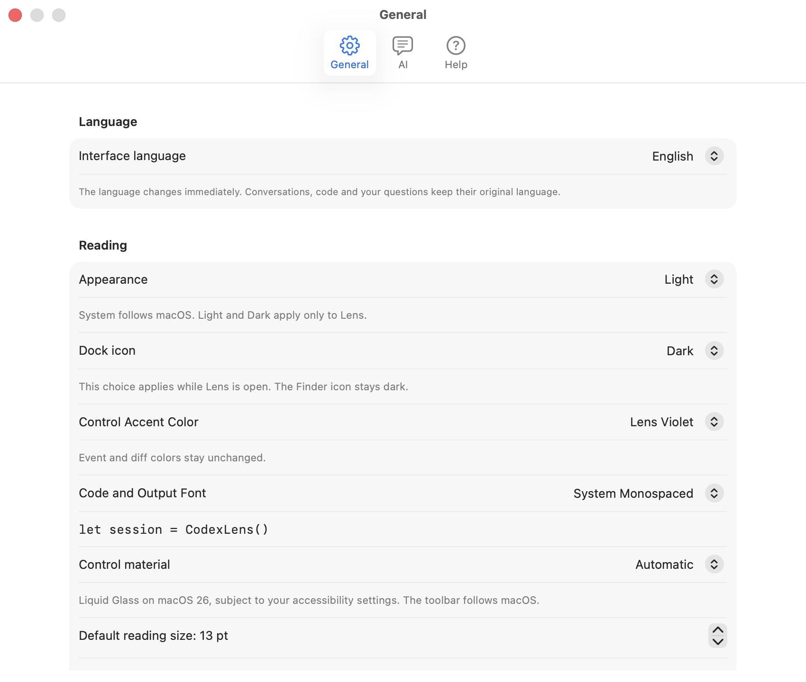

*The visible language, appearance, font and material controls apply to Lens. Further zoom and keyboard settings appear below when scrolling. Per-window reading adjustments do not change global macOS settings.*

Source: [settings](../Sources/CodexLens/LensAuxiliaryViews.swift), [reading configuration](../Sources/CodexLens/LensReadingPreferences.swift), [control palette](../Sources/CodexLens/LensBrand.swift).

## Native menus and keyboard commands

The menu bar and contextual actions dispatch the same captured object/window commands. Unavailable actions are disabled; a changed session/selection is not silently replaced as the target.

| Command | Shortcut or entry point | Scope/condition |
| --- | --- | --- |
| New Window / Open Session | Command-N / Command-O | Application/window |
| Settings / Quit | Command-Comma / Command-Q | Application |
| Minimize / Hide | Command-M / Command-H | Standard macOS behavior |
| Close tab or window | Command-W | Closes active app tab first; otherwise its window |
| Close window and tabs / all windows | Shift-Command-W / Option-Command-W | Preserves other windows for the former action |
| Back / Forward | Command-[ / Command-] | Current window history |
| Inspection views / chat | Command-1…6 / Command-7 | Requires observed session for Go To commands |
| Show/hide sidebar | Control-Command-S | Current window |
| Show inspector / chat | Option-Command-I / Option-Command-C | Shared auxiliary pane |
| Focus region | Option-Command-1…4 | Navigation, content, inspector, chat |
| Narrow/widen active pane | Option-Command-Left / Option-Command-Right | Focused resizable pane |
| Find / next / previous | Command-F / Command-G / Shift-Command-G | Focused text or current supported search target |
| Search session | Shift-Command-F | Opens activity search |
| Zoom in/out/reset | Command-Plus or Command-Equals / Command-Minus / Command-0 | Active timeline or reading text according to preference |
| Show live timeline / pause following | Option-Command-L / Shift-Command-L | Requires a session reader; pause is visual |
| Reset activity filters/agent search | Shift-Command-R | Depends on current section |
| Prepare question / bookmark | Shift-Command-E / Shift-Command-D | Selected supported object |
| Copy internal link | Shift-Command-C | Selected addressable object |
| Conversation and Guidance | Option-Command-E | Observed root, without conflicting sheet |
| Next/previous reading tab | Control-Tab / Shift-Control-Tab | More than one tab in current window |
| Show/hide toolbar | Option-Command-T | Current native toolbar |
| Customize toolbar | View → Customize Toolbar… | Native customization; Back/Forward group remains fixed |
| Full screen | Native window control/menu | Supported session window |

File → Recent Sessions retains up to **12** entries and offers Clear Menu. The Dock context menu adds New Window, Open Session, and the **five** recent sessions. An already-open recent session activates its existing window; unrelated windows remain intact. Closing every window keeps Lens in Dock; reopening recreates/activates a window.

The app uses its own reading tabs and intentionally disables a second native window-tab strip. Window frame autosave and visible-frame recovery help retain a usable workspace after display changes; this does not claim restoration of every session state across every system configuration.

Source: [menu commands](../Sources/CodexLens/LensActions.swift), [Dock/window lifecycle](../Sources/CodexLens/LensMacIntegration.swift), [toolbar](../Sources/CodexLens/MainView.swift).

## Help and onboarding

- **Help → Codex Lens Help** opens Settings → Help.
- Five illustrated topics cover session opening, activity, sources, questions, and workspace/shortcuts.
- Help uses numbered instructions and expandable complete command reference, with image enlargement.
- **Replay First Steps** opens the same three-step introduction; it retains the current session, filters, and draft.
- Onboarding offers language choice, Skip/Escape, Previous after the first step, and Return for Next/final Choose Session.
- **About Codex Lens** reports installed version/build and shortcut reference.

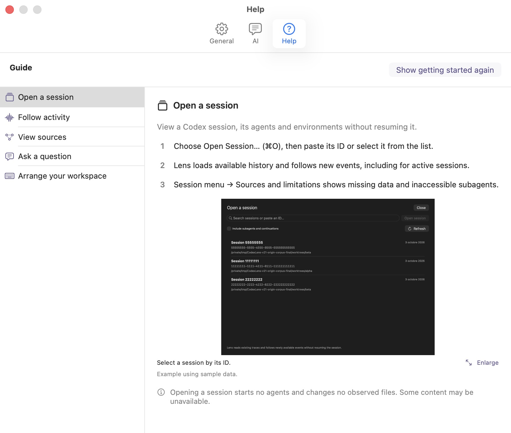

*The topic list keeps guidance inside Settings. The article gives numbered actions and source/version limits; Replay First Steps is optional.*

Source: [help/onboarding](../Sources/CodexLens/LensGuideView.swift), [guide articles](../Sources/CodexLens/LensGuideContent.swift).

## Coverage, privacy, and storage boundaries

### Inspect the collection limits

Session menu → **Sources and limitations…** lists collection/read issues with category, explanation, and source path. When a current `.jsonl` source is accessible, **Examine Current Source Journal** opens it as a current file; this is distinct from the frozen event.

Coverage can describe incomplete/replaced/malformed journals, unqualified trace shapes, inaccessible descendants, missing attachments, source mutations, unsupported versions, oversized records, or read/index limits. Missing records do not establish absence of activity. Recorded time and collection time have different meanings.

### Local and network behavior

- Observation and preview are local reads, without telemetry or automatic uploads.
- Lens writes its own cache, preferences, local investigation data, and explicitly selected exports.
- No UI command edits an observed repository, reruns its tools, resumes an observed thread, or installs observation hooks.
- Recognized credential/private-key paths and some secret patterns are excluded/redacted. This does not guarantee detection of every sensitive string.
- Cloud/nonresident files are marked unavailable instead of silently downloaded.
- Local Codex metadata/model checks can use Codex networking. Explicit Send transmits the question, attached context, and chat history to OpenAI.
- The chat applies verified technical restrictions for files/tools/hooks/connectors. It is not protected solely by a prompt; unsupported/unverifiable configuration is refused.
- Investigation threads/private workspaces are excluded from production-agent collection.
- A model response is an interpretation, not an observed production event. Citations navigate context; they do not automatically validate conclusions.

### Concrete budgets

| Operation/data | Default bound | Result when unavailable or over budget |
| --- | --- | --- |
| Observation index disk cache | **64 MiB** | Oversized index stays usable in memory but is not persisted; coverage notes reindexing on restart |
| Indexed events | **150,000 per journal** | Additional-source coverage limit rather than a claim of complete indexing |
| Single journal line | **64 MiB** | Explicit oversized/partial-record issue |
| Recorded output copy | **32 MiB** | Copy fails visibly; clipboard is not filled with a silently truncated substitute |
| Git blob/diff read | **8 MiB** | Explicit size refusal |
| Selected chat context | **256 KiB encoded total**; ordinarily **64 KiB encoded/entry**, structured origin context up to **128 KiB** | Omitted/partial items are visible before sending |
| Question text | **16 KiB UTF-8** | Explicit size refusal; draft remains available |
| Generated investigation request | **384 KiB encoded** | Explicit refusal before sending; no automatic resend |
| Received answer text | **128 KiB** | Over-budget reception is an error/incomplete response, not successful completion; draft/context remain available |
| Investigation archive | **32 MiB** | Rotation of older local saves is reported; an oversized individual record is refused |
| Portable investigation transfer | **32 MiB** | Refusal/validation issue; importing does not silently evict records |
| Main-thread conversation export | **256 MiB total**, **64 MiB/message** | Explicit unavailable/omitted text states; not silently filled from previews |
| File search | **5,000 files**, **1,000 folders**, **64 MiB text**, **4 MiB/file**, **1,000 occurrences** | Search reports skipped items and reached limits |
| Attachment search | **12,000 entries**, **4 seconds**, **96 MiB** | Candidate/search coverage is displayed |
| Markdown formatting | **512 KiB**, **10,000 blocks**, **50,000 runs** | Original text remains available |

Cache and archive budgets are **not a total RAM ceiling**. Large session families and directories can still require significant initial indexing time/memory. There is no universal performance or leak-free claim based only on these bounds.

Default stores are `~/Library/Caches/CodexLens/Index-v1` and `~/Library/Application Support/CodexLens/Investigations`. Exported conversations and archives can contain code, instructions, and paths; review them before public sharing.

Source: [collector](../Sources/LensCore/SessionEngine.swift), [content guard](../Sources/LensCore/LocalContentGuard.swift), [context packaging](../Sources/LensCore/EvidenceCapsule.swift), [archive](../Sources/LensCore/InvestigationArchive.swift).

## Developer tools

The component fixture gallery and its Development menu are available in Debug builds only. Public Release builds omit that scene and menu.

These tools are separate from normal session inspection; fixtures are never production history. The component gallery requires a Debug build.

| Tool | Entry point/use | Qualification boundary |
| --- | --- | --- |
| Native component gallery | Debug builds only: Help → Development → Component Gallery | Anonymous fixture identities, activity, provenance/citations, diffs, selection/questions, and loading/limit states |
| Gallery appearance/text controls | System/light/dark and standard/enlarged | Preview controls for the gallery, not account/session changes |
| `lens-inspect` | Built beside the app; see its command help | Read-only diagnostics, not a terminal embedded in the app |
| Build/test scripts | `bash scripts/build.sh`, `bash scripts/test.sh -c release` | Local checks are distinct from GitHub CI on the pushed commit |
| Release with symbols | `bash scripts/build.sh --profile` | Creates symbols for Instruments; compilation is not a performance measurement |
| Release packaging | `bash scripts/package-release.sh` | DMG/app ZIP/symbols/checksums; current builds are ad hoc signed, not Developer ID notarized |
| Release preparation | `python3 scripts/release_notes.py prepare <version>` | Preview-first version/build/changelog/notes update; `--write` requires a clean checkout and never tags or publishes |
| Focused native/fixture checks | Repository validation harnesses | Component screenshots/dispatch checks do not replace interactive macOS, trackpad, or VoiceOver qualification |
| Signposts | Collection/search/diff preparation paths | Enable measured scenarios; no improvement is implied merely by their presence |

Source: [gallery](../Sources/CodexLens/ComponentGalleryView.swift), [CLI](../Sources/LensInspect/main.swift), [build/release scripts](../scripts/).

## Capabilities that are not available

The following distinctions prevent implemented lower-level helpers or requested future behavior from being presented as current UI features:

| Capability | Current status |
| --- | --- |
| Universal Codex App Server compatibility | Local chat adapter is qualified for **0.159.2 and 0.160.1**, not arbitrary newer/older binaries |
| Observation through another process's App Server | Observation uses persisted local sources; a private chat server is not assumed to see external activity |
| Hook installation/instrumentation | No observation-hook setup is required or offered by this release |
| Trigger compaction to inspect it | No such action; Lens reads recorded compaction |
| Full context before/after every compaction | Only available recorded pieces/measurements are shown; opaque data remains opaque |
| Rendered token/context charts | Usage values are inspected as details; curve helpers do not establish a rendered chart feature |
| Automatic historical manual-edit capture | Current files/Git diff and recorded changes are distinct; unrecorded manual edits are not captured retrospectively |
| Automatic observed-change rows | The model/filter supports this kind, but the collector currently creates requested-patch and recorded-result rows |
| Complete block-lineage tracking | File activity and selected-line source context exist; an exhaustive block evolution graph does not |
| Time Machine/backup recovery | Attachment recovery searches selected current local directories; no backup integration |
| Automatic original-attachment hash matching | Recovery service supports explicit digest comparison, but the current UI does not supply the recorded original digest |
| Full-session portable export | Main-thread conversation export and selected investigation archive export exist; neither exports all tools/descendants/worktrees |
| Whole-session automatic chat context | Only attached bounded context and investigation conversation are sent |
| Arbitrary embedded HTML or remote image rendering | Chat uses bounded native Markdown and does not auto-fetch remote images |
| IDE editing/execution | Code readers are read-only; no run, patch application, LSP, semantic outline, or code-folding workflow |
| Universal generated-file attribution | Supported recorded roles/paths are shown; every tool format/producer cannot be inferred |
| Guaranteed deleted-source recovery | Links/references may remain, but uncaptured deleted bytes are unavailable |
| Automatic inference resend | Errors retain drafts; another Send is explicit |
| Independent account flow qualified everywhere | Advanced authorization/API controls are present; the verified personal path is installed Codex with ChatGPT |
| Intel/macOS 14 full runtime qualification | Deployment target and architecture statements are not complete runtime verification |
| Notarized distribution | Community release is locally/ad hoc signed; no Developer ID/notarization claim |

For a specific failure or unavailable record, inspect Sources and limitations and the exact selected version before treating today's file as historical content.

## Application updates and removal

- **Codex Lens → Check for Updates…** checks the signed stable GitHub feed. **Settings → General → Updates** offers optional automatic checks and the installed version. Installation needs your confirmation and replaces the current app in place, then relaunches it.
- **Settings → General → Maintenance** opens an uninstall review. Local Lens data stays by default. Optional cleanup lists only default Lens-owned folders and preferences; custom storage, Codex credentials, observed sessions, repositories and exports remain. Items move to Trash for recovery.
- Sparkle 2.10.0 is pinned. Feed and archive signatures are verified before extraction; release-note WebViews and system profiling are disabled. Developer/QA copies cannot use the uninstall command. See [updates and removal](UPDATES.md) for installation requirements and verification limits.

## Control accents

**Settings → General → Reading → Control color** selects Lens violet, slate, sage or the macOS system accent. Owned settings navigation, primary controls, search focus, text selection and navigation indicators share that choice and update in Light/Dark appearances. The System choice retains native macOS colors. Event-type, diff and syntax colors keep their separate meanings. System-owned menus and alerts retain platform styling.
