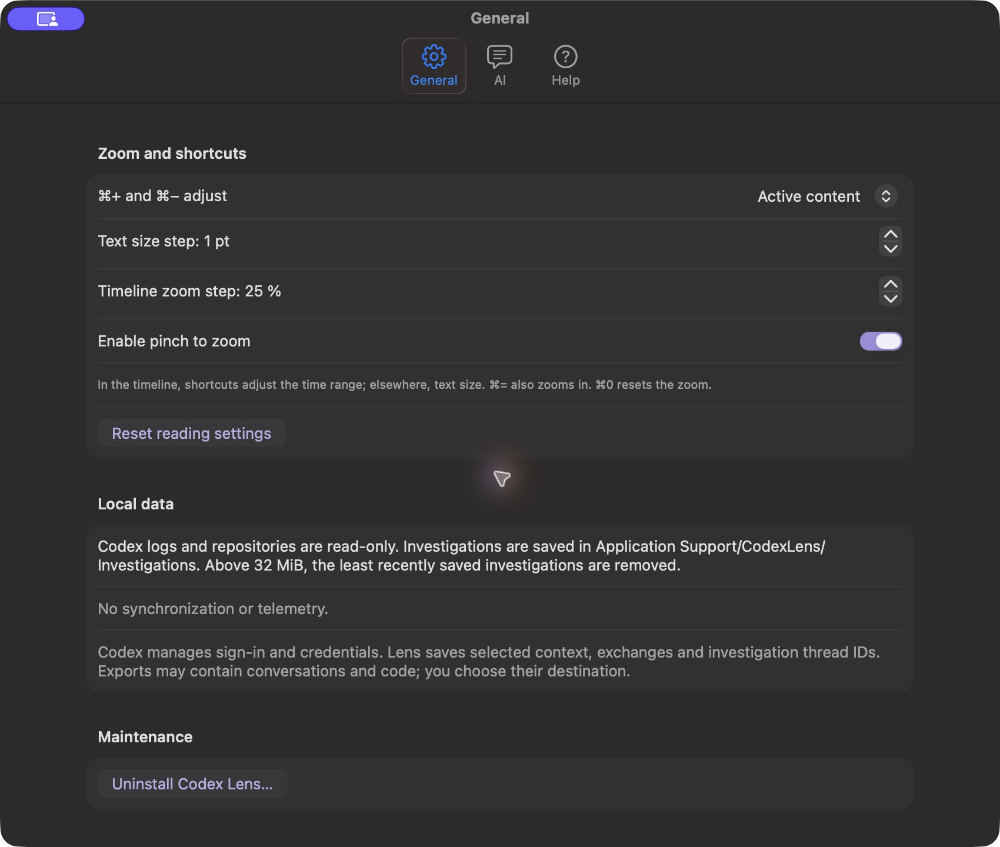
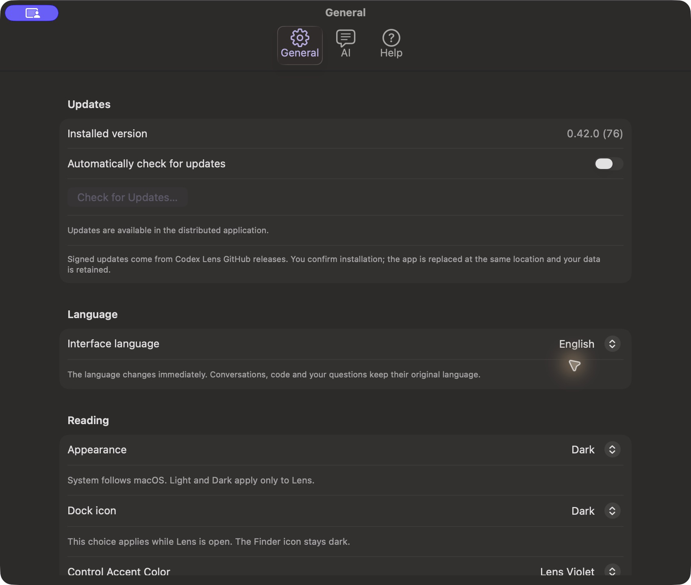
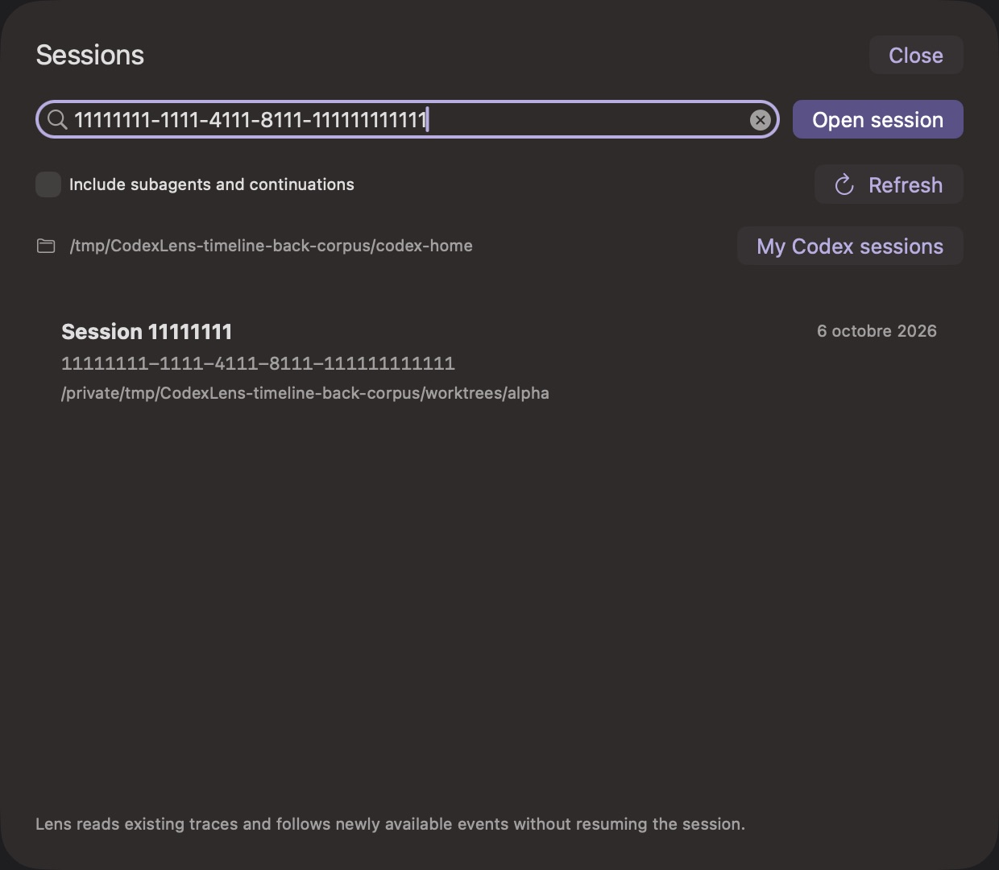

# Control-color consistency

## Observed problems

With Lens Violet selected, the previous Settings navigation glyph/title, default Open session button, search ring/caret and chat text selection could use macOS blue. Native switches and the event table already followed the selected Lens accent.

## Changes

A shared explicit accent environment drives owned navigation marks, file/agent symbols, hover/selection surfaces and AppKit text colors. Semantic event, diff and syntax colors retain their meaning. System mode continues to follow macOS.

Settings retains a native toolbar with three named borderless buttons and lazy content for the selected page. Its template glyphs/text use public contentTintColor. Native toolbar item labels remain accessible without a second visible caption. The session default button keeps native keyboard/accessibility actions and a compact intrinsic size. The owned search field retains native search/cancel/editing behavior, restores the shared editor colors, and refreshes its focus border on theme changes.

## Verification boundaries

Source-matched native checks exercise Violet, Slate, Sage and System in Light/Dark, retaining text/ranges/undo/scroll, native actions, shared-editor cleanup and toolbar selection. Actual Mac QA confirms mouse/AX/Return opening, named single-caption tabs, Help→General, immediate accent changes, text selection, and English→French→English synchronization. Earlier failed candidate captures were preserved locally; button sizing/activation, toolbar names, duplicate captions and stale General language were repaired before delivery.

The captures are original compositor output, while the automated probe uses native state/AX and bitmap caches; those methods are distinct. VoiceOver, other macOS versions, physical resizing and performance remain unqualified. [Capture identities and hashes](../images/control-colors/README.md).
