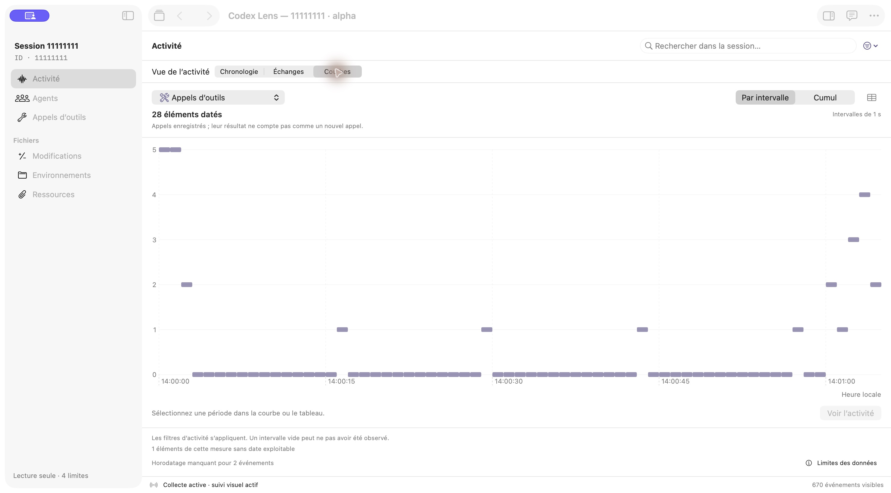
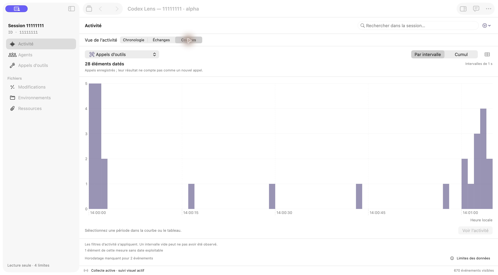
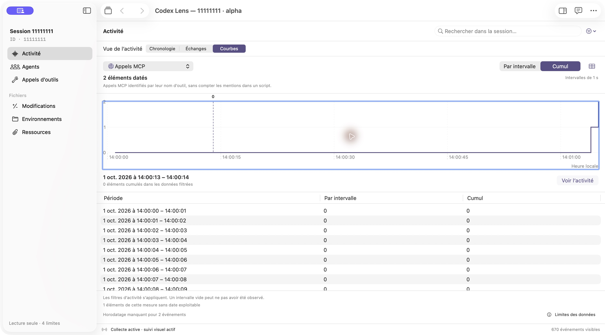
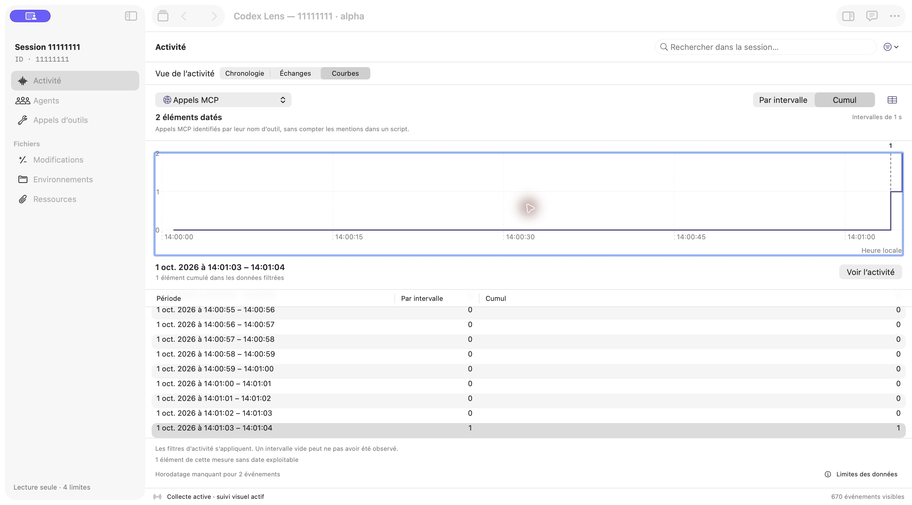
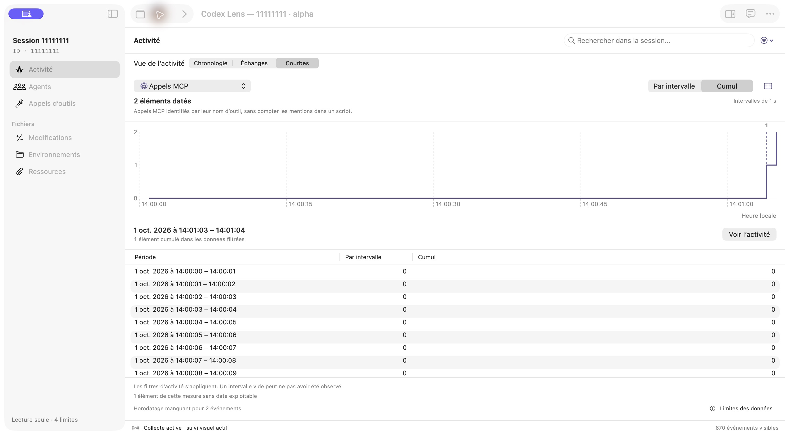
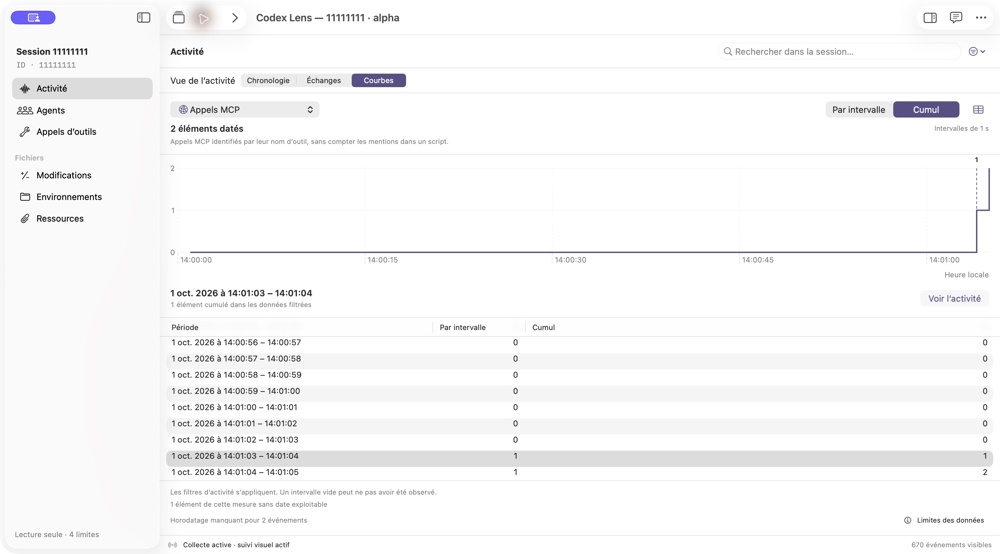
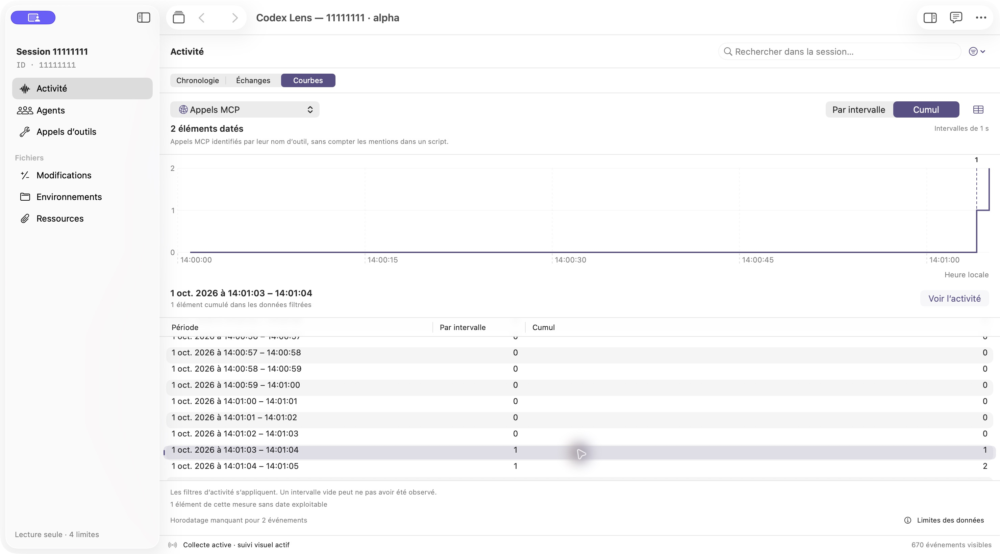
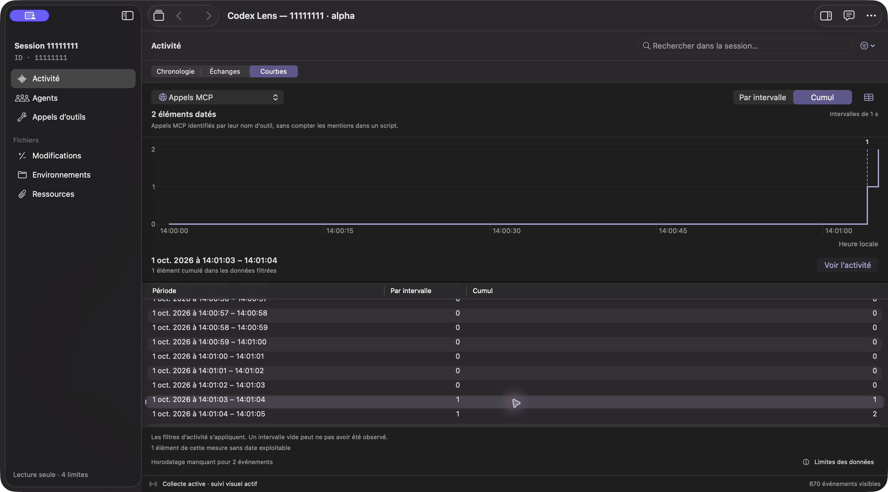

# Session curves

The Charts mode belongs to Activity and uses its session, agent, environment, event-type, search and period scope. It does not create a separate dashboard or observe another session process. A selected interval opens the existing timeline; navigation history preserves the selected metric, cumulative mode, date and values-panel visibility.

## Reading and navigation

1. Open a session, choose **Activity → Charts**, and retain or adjust the activity filters.
2. Choose one metric. **Per interval** shows counts in each time bucket; **Cumulative** adds the filtered dated counts up to each bucket's end.
3. Use the table icon to show numeric periods, interval counts and cumulative counts. With focus in the chart, Left/Right changes the shared selection; the native table also supports keyboard row selection.
4. Choose **View activity**, press Return, or double-click a table row to open that interval in the existing chronology. It includes overlapping recorded calls as context.
5. Use toolbar **Back** to return to the chart's metric, mode, selected date and values-panel visibility. Table reveal on this return has its own verification scope below.

The published images use French UI labels: **Courbes**, **Par intervalle**, **Cumul**, and **Voir l’activité** correspond to Charts, Per interval, Cumulative, and View activity. Recorded fixture text is not translated.

## Data meanings

| Metric | Counted item |
| --- | --- |
| Events | Canonical recorded events visible in the activity scope |
| Tool calls | Recorded invocation identity, qualified by agent; results do not add invocations |
| MCP calls | Invocations with an explicit qualified MCP name; source-code mentions do not count |
| Requested changes | A requested file target per logical call and environment; applied/current file state is not inferred |
| Reported errors | Known failure records associated with a call where identifiers allow it |
| Recorded waits | Wait calls or standalone wait events; idle duration is not inferred |
| Compactions | Operations identified by the existing canonical compaction index |

Undated or unsupported timestamps remain counted separately and are not drawn at an invented time. Source coverage passes through from the session. Zero matching records in an interval is not proof that the interval was fully observed.

Completed-item failures use their recorded end rather than being placed at the invocation's start. An explicit result record takes priority. If a completion date is missing, that failure remains unplotted even when its invocation has a known start.

UTC-aligned bins use a bounded adaptive resolution, retaining empty intervals and at most 240 plotted buckets. The values table shares the chart selection and exposes interval/cumulative counts. Drilldown retains source-event identities independently of plotted mark density. Bucket periods are half-open; their timeline filter ends immediately before the next bucket's start.

## Component decision

The implementation uses the SDK's native Swift Charts framework, without third-party dependencies, WebView or custom GPU code. Apple's [chartXSelection](https://developer.apple.com/documentation/swiftui/view/chartxselection(value:)) is available on macOS 14, matching the deployment target. Compilation uses Xcode 26.6, Swift 6.3.3 and SDK 26.5; that does not qualify every interaction on macOS 14.

The Core projection handles metadata counting and deduplication. SessionPresentationBuilder prepares it on its actor executor, reuses it for agent-tree-only query changes, and publishes it through the existing cancellable generation mechanism. Switching the visible metric or cumulative mode only reads the bounded prepared buckets. Source journals are not reopened by a chart selection.

## Verification layers

Core regressions exercise call/result mirrors, repeated calls across agents, explicit MCP naming, distinct worktrees, missing timestamps, compaction identity, long gaps, bounded bucket counts and source-ID drilldown. Presentation regressions check shared filter scope, revisions, root changes and independent agent-tree queries.

The dedicated anonymous corpus adds dated and undated MCP calls, a recorded failure, waits, an incomplete last journal line and another source with the same root ID. No recorded command is executed. The native entrypoint checks chart/table selection, period navigation and Back, reader tabs, changed sources, stale commands, and a clearly labeled in-memory model publication. Such a publication is not a live collector test.

The initial local Release suite executed **557 tests, five optional skips and no failures**. The initial native curve entrypoint passed **35 assertions**, including selecting and revealing an offscreen table row, changing selection from the chart state, and restoring the curve state after period inspection. This test phase preceded the subsequent source-transition and Back/remount corrections. Its light/dark/narrow bitmap-cache renders were inspected separately from actual app-window captures. The source journals and worktree files remained unchanged during the checks.

Passing native assertions did not establish that the compositor's table viewport was correct after Back. The actual app replay below found a remaining layout/remount case; that finding is kept separate from the earlier test result.

## Actual app-window review

The isolated QA builds used the same anonymous corpus. Their identities and original JPEG hashes are recorded in the [public capture manifest](../images/curves/capture-manifest.json); the [capture notes](../images/curves/README.md) describe the method and exclusions.

| Phase | Build identity | Scope |
| --- | --- | --- |
| Baseline | UUID `12946FC2-09FB-3582-9770-DE86DE95A51D`; 108 source inputs matched its build receipt | Before histogram orientation and native values-table corrections; exact baseline commit not established |
| Rendering replay | Commit `77322f2c31da0f4506c44268ccdfdeab8aa1d75f`; UUID `C044565C-164E-3B9D-9613-4D34FD42646D`; 109 source inputs matched its build receipt | Corrected rendering and direct selection reveal; before subsequent source-transition dispatch and Back/remount corrections |
| Navigation replay | Frozen development source based on `77322f2` plus uncommitted source-scope and bucket-anchor corrections; UUID `69B9CA48-2C2A-3698-B72E-213DC8D3D74B`; 109 matching source inputs | Two controlled Back returns reveal the late selected row; reader/workspace/history return also preserves its chart context; not a clean-commit release |
| Selected-control appearance | Frozen source with the preceding corrections and two presentation modifiers; UUID `7243AAE4-A26E-3CF0-B80B-5F224CC4C35E`; 109 matching source inputs | Light/dark visual check of filled selectors and shorter activity picker; no fresh logical or navigation replay |
| Final palette | Frozen dirty release-candidate source with native row-selection accent reuse; UUID `4DF7E741-494C-300B-A944-186CA06B2B6D`; 109 matching source inputs | Actively selected violet values row and filled selectors in light/dark appearances; visual check only, not a new native or Back regression batch |

The JPEGs are original CUA native `App.getScreenshot` compositor captures, copied unchanged after hash and dimension checks. They are not bitmap-cache renders or recreated interfaces. No personal session, account, credential, AI request, recorded command or external resource was inspected or executed. The launch did not provide an OS network-denial guarantee.

### Histogram orientation: corrected in the rendering replay

**Baseline:** Activity → Charts → Tool calls → Per interval rendered floating horizontal pills at each count, including a row of pills for zero counts. The range-bar overload did not create columns rising from zero.



*The baseline has 28 dated tool calls in one-second buckets; the marks do not visually connect the counts to zero.*

**Rendering replay:** the zero-based interval rectangles produce vertical histogram columns. The same metric, corpus, dated count and bucket width are shown.



*The metric and mode stay at the top, counts occupy the plot, and undated items and collection limitations remain below it. Empty intervals do not create floating marks.*

### Offscreen chart selection: corrected for keyboard changes and values-panel reopening

**Baseline:** after table selection and chart-focused Right presses, the chart selected 14:00:13–14:00:14 while the table still showed its first rows. Native accessibility state eventually confirmed the correct selected row; the visible problem was that it had not been brought into view.



*The selected period appears below the plot, but its row is absent from the table viewport.*

**Rendering replay:** MCP calls → Cumulative → Show values → chart focus → repeated Right presses selected 14:01:03–14:01:04. The native row 63 was selected and visible; the scrollbar moved to approximately 0.979. Hide values → Show values retained and revealed the same late selection.



*The plot marker, selected-period description and highlighted values row agree. This comparison uses a later selected period than the baseline; both periods were beyond the initially visible table rows.*

### Back/remount reveal: still observed on the captured revision

From the revealed late MCP interval, **View activity** opened the existing chronology for 14:01:03–14:01:04, showing 15 context events including the invocation and its result. Toolbar **Back** restored Charts, MCP calls, Cumulative, values visibility, the selected date and native row 63.

The table viewport nevertheless returned to its first rows, with scrollbar 0, leaving the retained selected row offscreen. This persisted after further accessibility observation and a settled compositor capture. It was a major return-navigation defect on `77322f2`, not merely an early accessibility snapshot.



*The selected period remains 14:01:03–14:01:04; the table again starts at 14:00:00. This is a before-correction capture for the subsequent Back/remount fix.*

### Other observations and source-transition scope

The rendering replay verified singular one-item labels and the ordinary activity list's unavailable-timestamp wording. Undated records no longer extend the timeline to a sentinel calendar date; they remain listed and counted separately. At the captured wide size, table text and headers were legible. A raw crop rejected a suspected column-overflow issue and is not published as an original screenshot.

Code review found a separate major race when changing source directories while keeping the same root UUID: an old presentation could remain visible during preparation and then dispatch against the new source. This was a code-review finding, not reproduced by the single-source GUI replay. The capture commit precedes its dispatch correction and cannot qualify that correction.

## Follow-up source and navigation qualification

The frozen follow-up build retires old projections after a source opening succeeds, validates period actions against their source/opening identity, and preserves table reading by a stable bucket/date anchor. Selected-row reveal waits for a document tall enough to contain the row. The 109-input source manifest has SHA-256 `bd0f3a8d0a8de2f0245205e229ff42cb3a1a9eaac3140209b4b9a1ec64431360`; it identifies the frozen dirty development source above, not a clean release revision.

That frozen native entrypoint executed **41 checks, all passed**, with process exit 0. The added scope includes same-root source transitions and rejected old-source commands, table reveal after timeline and reader returns, and preserved manual reading during model publication and rebinning. Two source-transition regressions fail against the earlier `77322f2` code and pass with the correction. Core code was unchanged after the **557-test Release logic suite with five optional skips and no failures**; the new UI/dispatch behavior is covered by the native batch and GUI replay, not attributed to that older logic run.

Those 41 checks ran in a separately compiled source-matched probe replacing `@main`, UUID `6DEDA9E5-4F2A-3B94-9EB7-E98AE83E50FF`. They do not test the production entrypoint. The independent production-interface replay below uses UUID `69B9CA48` from the same frozen app-source phase.

### Controlled Back returns: selected row visible

Starting with Charts → MCP calls → Cumulative → Show values, chart-focused arrows selected 14:01:03–14:01:04. Two controlled **View activity → toolbar Back** cycles restored the metric, mode, panel visibility, selected date and row 63. The selected row was visible after both returns; each observed scrollbar value was approximately 0.993. The process and AX window identifier stayed the same, and current control references were reread before each action.



*The selected period matches the earlier Back-defect capture. The table now displays and highlights its row; the next interval's cumulative value remains independently visible below it. This capture qualifies the controlled return on UUID `69B9CA48`, rather than relabeling the older image as an after-fix screenshot.*

From the period-filtered chronology, Return opened the selected recorded `apply_patch` event in its own reader tab. The Activity workspace item preserved the period and selected event on return; native history Back returned to Charts/MCP/cumulative/late-period context with the values row visible. This reader route was verified through native accessibility observations; no separate reader compositor image is published here. Viewing the recorded patch did not execute it.

### Isolated state change: unexplained, not reproduced

Before the two controlled cycles, a late chart selection was followed by an unexpected observation of the initial chronology, with no period filter and Back disabled. No intentional navigation action explained that change in the recorded sequence. The same process and AX window identifier were subsequently observed, but the available inventory did not supply a complete window list or count.

Re-entering Charts retained MCP/cumulative/values visibility and had no selected date. The initial reset itself was not captured in a JPEG; a later re-entry image does not stand in for it and is excluded from publication. No matching crash report was found. These observations establish no cause. The change did not recur in the two cycles using freshly read controls, and those successful cycles do not establish that this isolated observation has been corrected.

The follow-up GUI run used only one anonymous source. It does not qualify source-transition dispatch through interactive source switching; that scope belongs to the dedicated native regressions. No final GitHub CI success is inferred from the local test batches or captures.

## Selected-control appearance

A supplementary native General-settings check changed appearance on UUID `69B9CA48` without relaunching the QA app and retained MCP/cumulative/values visibility, period 14:01:03–14:01:04 and its visible selected row. Visual inspection then prompted two presentation changes: the existing filled-control accent is used for the activity-mode and interval/cumulative selectors, and the redundant visible activity-picker label is hidden while its accessible description remains.

The separate UUID `7243AAE4` visual replay inspected those controls in Dark and Light. Their selected segments have a dark violet fill and visibly legible white text, and changing appearance retains the metric, mode, date and selected row. Its source manifest SHA-256 is `f7bad1b3b3df409db1e6d29897b2510453590df3b42faa39cdbdab46f1ade5ba`. The values table in this phase still uses the native system blue active-row appearance; this is before its subsequent accent harmonization.

The visual replay is not a fresh run of the 41 native assertions or the two Back cycles. A palette calculation and visual label inspection are distinct from a measured screenshot contrast ratio; no such measured ratio is reported.

### Final active-row palette

The values table now reuses the existing `LensTableSelectionRowView`, aligning its active row with the app's violet palette without changing the selection model. The last frozen visual build has UUID `4DF7E741-494C-300B-A944-186CA06B2B6D`; its 109-input source manifest SHA-256 is `c884084e18f780df480e1ddc57d9382d1f68fbdaec52059913acbce8ab1b0bc3`.

The row for 14:01:03–14:01:04 was activated through its native accessibility target in both appearances. The original light/dark compositor images show a pastel-violet selected row with a violet edge marker and dark violet filled selectors with legible white labels. The duplicate visible activity-mode label remains absent while its accessible name is retained. Changing appearance preserves the metric, cumulative mode, values panel and selected period.



*The late MCP interval is visible and selected. The edge marker and period text accompany its color treatment; collection limits remain below the table.*



*The final visual check inspected the chart, table, metadata and controls at this wide size. It did not replay Back or source changes, rerun the 41 native assertions, measure contrast numerically, or qualify narrow windows and hardware input.*

These last captures remain bound to the frozen dirty release-candidate source. They precede the visible-region scroll correction below; their palette qualification is retained, but they are not screenshots of that later scrolling behavior. A later commit or CI run requires its own source mapping and result; neither is invented from a screenshot.

## CI failures and visible-region correction

GitHub CI attempts at `77322f2` and `7dd3c561feefea9ca88f839a2872fd18e595e306` failed during the initial values-table loading/reveal stage. The latter attempt stopped before viewport diagnostics were available. Neither run passed. A local attempt to reproduce the failure in a **1024 × 640 window with legacy scrollbars** completed all **41 checks** in Native13. The CI failure was not reproduced by that local attempt, and its exact cause has not been established.

The subsequent source correction reveals the selected row using `NSTableView.visibleRect`, including ancestor clipping and insets, instead of assuming the enclosing clip-view bounds describe the region people can see. It adjusts the vertical origin through `constrainBoundsRect` while preserving horizontal reading. The corresponding assertion requires the row's **entire height** to be visible and the visible region to have positive width. It does not require the full width of a horizontally scrollable table to fit on screen.

The corrected-source Native14 batch also completed **41 checks, all passed**, in the compact legacy-scrollbar configuration, with process exit 0. Its source-manifest SHA-256 is `71c0cad27fcf0afd5d463be4bc607d40e9800fe1e11a80c60c222165da3633f2`. It is a separately compiled native probe replacing `@main`, based on `7dd3c56` plus the pending scroll/assertion changes; it is not a new production-compositor replay or a successful CI run. The earlier UUID `4DF7E741` JPEGs have not been relabeled as qualification of this correction.

The test's failure path now records horizontal and vertical geometry, selected-row bounds and height/width visibility separately, clip/document visible regions, content insets, scrollbar style, and ancestor frames/bounds/visible regions. These diagnostics are intended to make the next CI failure inspectable. Their addition does not explain the earlier failures, which occurred before this diagnostic data was available. Final-head CI remains to be checked independently.

## Reproduction commands

```sh
python3 scripts/create-curves-corpus-v77.py --output /private/tmp/lens-curves-corpus --events 600
zsh scripts/verify-design-v07.sh --source-root "$PWD" --output /private/tmp/lens-curves-check --corpus /private/tmp/lens-curves-corpus --entrypoint SessionCurvesV77Main.swift --after-source-freeze --run
bash scripts/test.sh -c release -Xswiftc -g --jobs 3
```

## Remaining qualification limits

Native CUA accessibility actions and chart/table keyboard selection were available. Direct physical chart-mark selection was refused by the service; no alternate input method was used to bypass it. Hardware pointer selection, trackpad gestures, split-divider dragging, VoiceOver and deliberately narrow-window resizing were not qualified by this replay.

Dark appearance was not replayed on the rendering-correction executable, which was left in the Back defect state for diagnosis. The later dark and light checks have the separate source identities described above. Light/dark/narrow native probe PNGs are bitmap-cache renders of production views, not compositor screenshots.

The controlled navigation replay qualifies the described Back and reader-return cases. It does not qualify the unexplained state change's cause, a complete window inventory, live collector throughput, CPU use, memory use or latency. A status label saying collection is active is not a performance measurement. No performance improvement is claimed from compilation or passing tests, and local test results do not establish GitHub CI success.
