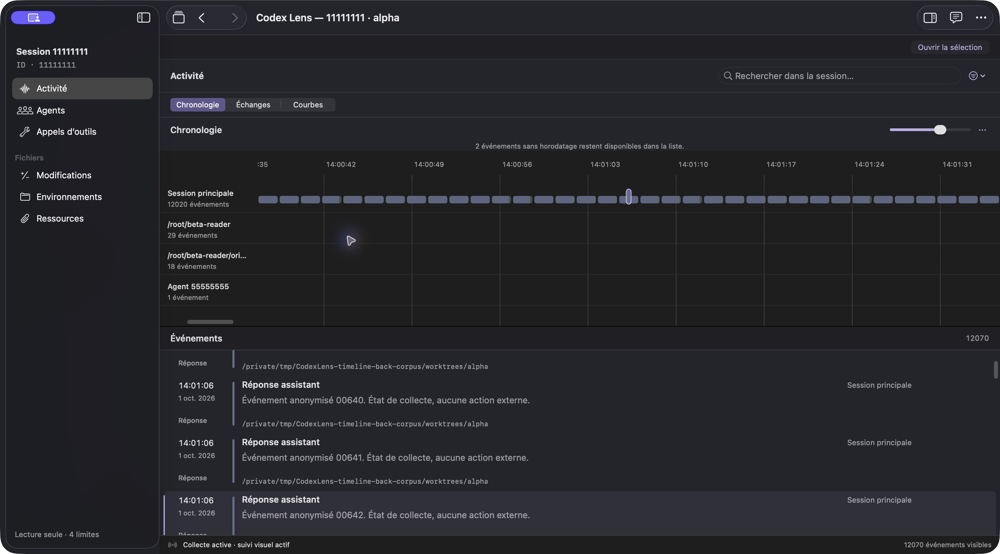
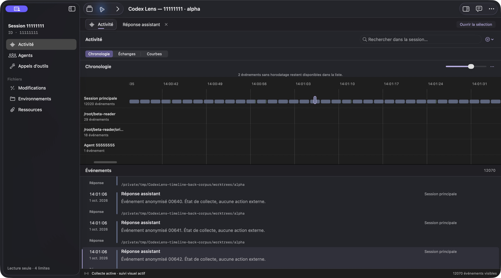

# Timeline repaint after Back

Returning from an event reader should restore the timeline's selection, zoom and horizontal reading position, with marks beside the usual agent-label region.

## Change

The native timeline coordinator now schedules a repaint on a bounds notification **before** the guards that decide whether a scroll position may be published. Restoration/layout notifications can repaint without overwriting the saved origin. A second invalidation follows the final frame and clip-origin restoration. The protected stored-origin guards remain in place. See [the coordinator](../../Sources/CodexLens/ActivityView.swift).

## Actual app replay

| Source | Bounded result |
| --- | --- |
| Clean baseline `32d8987a370ac716eaf5f77cefd6b8cfd198bc42`, UUID `B75E9FC9-9B1F-34C7-8245-075A78CA8ED8` | Four routes did **not** reproduce the reported large left gap: reader → Back, a narrower inspector pane, a width change while reading, and closing the active reader tab. |
| Frozen baseline plus repaint correction, UUID `5809E481-C054-3ECE-9B6D-CD9633C11A4B` | Three **18×**, horizontally panned reader → Back routes retained the selected 14:01:06 assistant message and zoom, with no large left gap. The inspector was shown or hidden to vary pane width. |

Both replays used only a dedicated anonymous corpus containing **12,070 loaded events**. No personal source, authentication, AI request or recorded command was used. The fixed production app's **109 source hashes** matched its frozen manifest.

*Before entering the reader on the fixed build: the selected mark, ruler and event-list selection are visible. The purple system badge and glowing pointer are capture/system overlays, not Lens features.*

*First returned capture after Back: the reader tab remains open, and the timeline and selected event are retained. These are before-reader/after-Back views of the **same corrected build**, not before-fix/after-fix images.*

The two JPEGs are unchanged native CUA `App.getScreenshot` **compositor captures**, not bitmap-cache renders. Their hashes, dimensions and sanitized source identity are in the [capture manifest](../images/timeline-back-viewport/capture-manifest.json).

## Native checks and oracle limits

The [V76 native probe](../../Tests/NativeUI/WorkspaceNavigationV76Main.swift) checks actual coordinate conversions and visible-viewport coverage **before** its separate bitmap-cache render. Three added checks cover the initial timeline, reader → Back and reader → workspace return, including the visible left edge and sticky-label placement. Saved origin, zoom, selection and independent-window behavior retain their existing checks.

Diagnostic `needsDisplay` flag experiments were excluded from the final harness. A windowless prototype failed on both sources because AppKit suppresses that flag without a window; realized-window experiments passed on both because parent damage and automatic observers can mask individual invalidation flags. Neither supplies a negative control or establishes the cause of the reported gap.

The baseline and final corrected-source native batches each passed **79/79 checks**, with process exit 0: the existing 76 checks plus three viewport-coverage checks, without the flag assertions. Native checks replace `@main` and are separate from the actual production-app replay above. Since the baseline also passes, this is not a failing-before/passing-after demonstration.

The local Release suite executed **564 tests, five skipped, zero failures**. These local results do not establish GitHub CI success.

## Remaining limits

The large gap was not reproduced on the current baseline; the reported screenshot's runtime identity is not established. Successful returns on the corrected build do not prove the cause of that report. The first-return capture follows normal tool observation latency and cannot qualify every first-paint frame or a brief transient gap.

Pane-width variation used the native inspector control. Physical outer-window resizing was refused during the baseline attempt and was not bypassed. Hardware trackpad behavior, VoiceOver, live ingestion, memory use, compositor latency and CPU performance are unqualified. No measured performance improvement or GitHub CI success is claimed.
