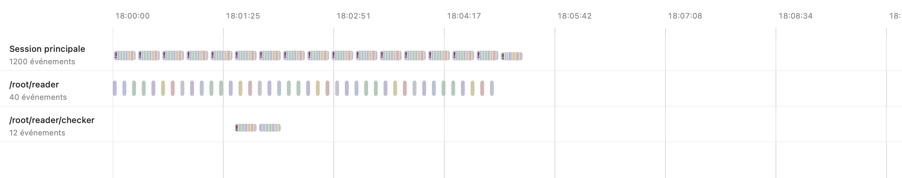
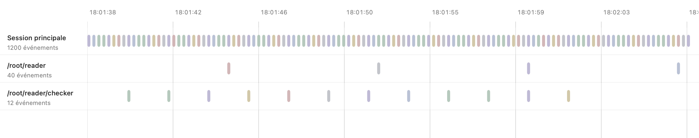
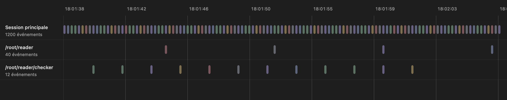

# Colored timeline marks

The timeline uses the existing event palette for both individual events and dense groups. Zooming reveals separate marks when they fit; zooming out restores groups without removing events or changing their identities. Group marks have no numeric badges. Counts remain available through their tooltip, accessibility label and context menu.

## Reading and navigation

1. Open **Activity → Chronology** and view a dense period. A thin multicolor group represents the events intersecting its time bin.
2. Click a group to focus its recorded period. Its context menu also offers zoom, the period's event list and a bounded sample of original events.
3. As the time scale expands, separate event marks appear when their actual rectangles can be distinguished. Select a mark or open its context menu to inspect the corresponding original event.
4. Zoom out again. The same events regroup; an existing selection remains accessible inside its group.

Grouping uses approximately **32-point bins**, at most **256 bins per lane**, and a detail threshold of **12 events per bin**. The threshold alone does not expose individual marks: their rectangles must also be separated by a **one-point gap**. Events with identical or overlapping times remain grouped when zoom cannot make their rectangles distinguishable.

Each group's color segments represent its exact event-type composition, calculated from all matching events rather than its menu sample. Segment positions do **not** describe the order or time of individual actions. A failed event contributes to the error type, consistent with its individual mark. Error groups also carry an exclamation mark; descriptions expose the composition in text.

A long event may intersect several bins. Each bin's count is exact for that bin; summing group counts is not a unique session-event total. Agent lanes remain independent.

## After-change renders

These three images are unchanged PNGs produced by native **AppKit bitmap caching of the production timeline component** in the V78-3 probe. They are **not compositor screenshots**, a full-app interactive replay or an illustrated reconstruction. The anonymous in-memory fixture has 1,200 root events and two descendant lanes containing 40 and 12 events. Recorded-looking task names are fixture text; no user session was opened.

*The root lane is grouped, with no numbers inside the group marks. Color portions describe type composition; the lane's event count remains visible beside its name.*

*At the intermediate scale, the root events fit as separate marks. The lower lanes retain their own events and positions.*

*The same intermediate period in Dark appearance. This component render does not qualify physical input, VoiceOver or full-window layout.*

There is no baseline image comparison here. Older V38 captures are not treated as the appearance of the `033b2ac` baseline. Image hashes, dimensions and the rendering method are recorded in the [render manifest](../images/timeline-colored-marks/capture-manifest.json) and [capture notes](../images/timeline-colored-marks/README.md).

## Source and local validation

The frozen source is based on `033b2ace8dd8791c1283a20125c57760481c53a9` plus the uncommitted timeline-color and density corrections. All **108 source records** in the probe manifest matched the checkout when these documents were prepared. The native probe replaces the production `@main`; its executable UUID is `56B45C50-6C47-38CB-BA52-524B3C35D766`.

| Check | Observed result and scope |
| --- | --- |
| V78-3 native component probe | **34/34 checks passed**, completed, process exit 0. It owns a native test window and dispatches local `NSEvent` and accessibility actions. |
| Grouping and composition | Exact counts and kind composition, original sample IDs, independent agent counts, group click/menu/list actions, tooltip and accessibility descriptions. |
| Zoom and event navigation | Many separable intermediate marks, original visible IDs, non-overplotting, mark selection/menu opening, keyboard order, and identical composition after zooming out. |
| Selection and updates | Selection survives regrouping; repaint reuses the bounded density cache; an in-memory append updates counts without losing selection; stale accessibility actions reject a replaced projection. |
| Rendering | Eight bitmap-cache PNGs cover overview, intermediate and detail in Light/Dark, selected-event dezoom and a narrow overview. Three are published above. |
| Local Release logic suite | **564 tests executed, five skipped, zero failures**. This is a local result, not GitHub CI. |

The pixel checker was corrected to respect the bitmap's tagged color space, including Display P3, instead of interpreting its raw components as Generic RGB. Adaptive palette values are resolved within the rendering appearance, and both palette and pixels are converted to sRGB. The existing acceptance thresholds were not lowered. The check establishes the presence of several color families; it is not an exact-pixel snapshot or a contrast measurement.

The source-manifest SHA-256 is `42ed783d53d47c4cfe797d3ff7f5842bbffc3706037b82ddd2aa030d7e88bba4`. Native receipt and Release-log digests are retained in the public render manifest without publishing machine paths or raw logs.

## Storage and performance boundaries

The additional type-composition index partitions start ranks and end values by event type. Every event contributes one `Int` start rank and one `Double` end value across those partitions: roughly **16 bytes per event on a 64-bit target**, plus array and dictionary storage. It does not allocate a full-size prefix vector for every type. The retention estimate adds a conservative **32 bytes per event** for this change; neither figure is a measured process-memory delta.

The timeline canvas's density-plan cache has a **2 MiB estimated retention budget**. This bounds that cache, not the entire app or session index. Retained counts and original IDs do not depend on retaining the drawing cache. A dense group changes the presentation; it does not discard its source events.

The append check updates an in-memory projection; it is **not live collector ingestion**. Physical pointer/trackpad interaction, a VoiceOver session, production compositor output, CPU use, RAM use and latency are not qualified by this batch. No memory or speed improvement is inferred from compilation, cache bounds or passing checks. GitHub CI must be checked on its own revision.

## Relevant implementation

- [Timeline model and density indexes](../../Sources/LensCore/TimelineModel.swift)
- [Native timeline rendering and actions](../../Sources/CodexLens/ActivityView.swift)
- [Density regressions](../../Tests/LensCoreTests/TimelineDensityTests.swift)
- [V78 native appearance probe](../../Tests/NativeUI/TimelineAppearanceV78Main.swift)
