# Workspace navigation audit

The reported route was **Activity → select a message → Open in Tab → return to Activity**. The original workspace should remain easy to find, and returning should preserve the selection and reading position.

## Baseline

An independent reviewer drove the actual 0.41.0/build 75 application through macOS accessibility actions with an anonymous 600-event fixture. The source-matched QA copy retained the production executable and replaced only its application identity and disposable data locations. No user session was resumed or changed, and no AI question was sent.

Four major issues were reproduced:

| Issue | Observed behavior | Correction |
| --- | --- | --- |
| Missing return destination | Opening a reader removed the timeline, leaving only the message tab | The originating collection has a persistent return item beside readers |
| Opened tab overwritten | Back, then a normal list click changed the previously opened tab to another message | Ordinary collection selection does not create or retarget explicit reader tabs |
| Reading position lost | Back retained 19.6× zoom but changed horizontal framing and list position | Checkpoints retain timeline origin and the list’s top event plus row offset; restoration waits for layout |
| Last close clears selection | Closing the final reader cleared the activity selection | Close restores the latest originating collection and selection |

### Reader hides its origin

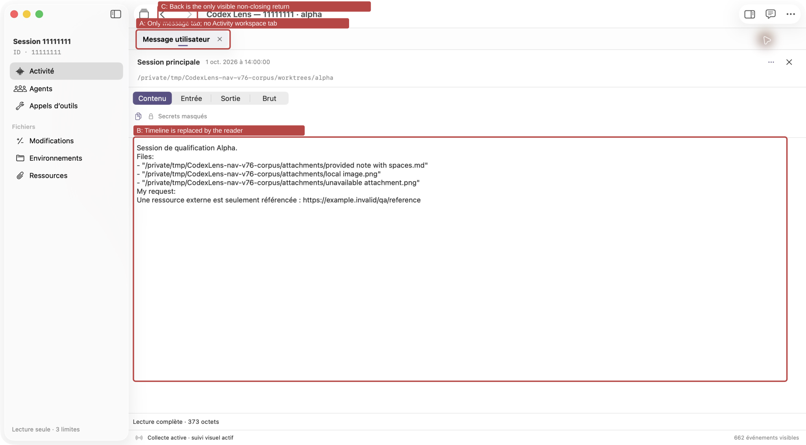

### An explicitly opened message is replaced by a normal click

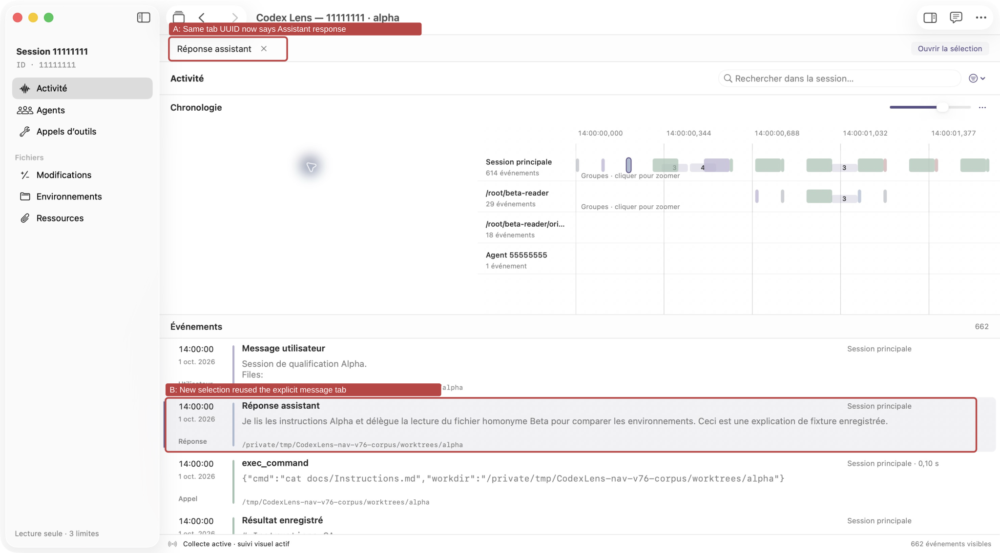

### Closing a reader resets the independently scrolled list

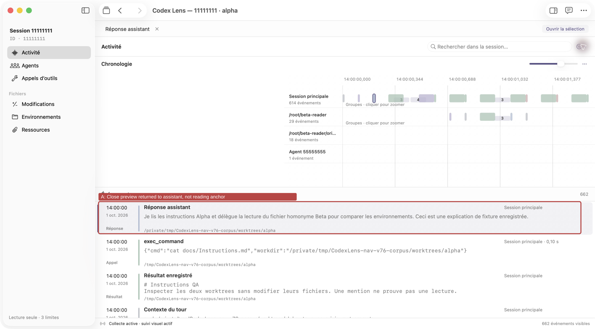

### Closing the last reader clears selection

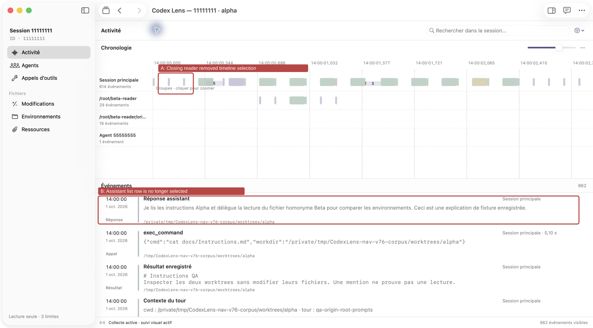

The annotations are vector overlays on unchanged compositor JPEGs, embedded in the SVG files. These are recordings of the baseline defects, not mockups of the fix.

## Design and implementation

The app retains navigation metadata rather than keeping every native reader and its full text in memory. Back/Forward and the collection return item restore the selected object, activity filters, timeline period/zoom/pan, event-list anchor and paused-live state. A qualified temporal midpoint retains the coordinate reference across temporary viewport and scrollbar layouts. Native list updates continue to preserve their anchor during collection.

Control-Tab cycles between the originating collection and reading tabs, including a single reader. Command-W closes the presented reader or preview, then the window when no reader is presented; it does not close an inactive tab.

The selected-item **Open in a new window** command carries the full destination, observed source, reader pool/cache and investigation archive into a distinct scene request. The new window waits for presentation indexes and revalidates its opening generation before selecting the object. Closing either window releases only its own observation leases. Missing source journals disable this new-window command for archive-only content instead of offering a nonworking action.

The production-scene replay exposed a fifth, critical issue that the initial model harness could not catch: opening a second window crashed on AppKit's toolbar-family insertion path. Both windows used the same customizable toolbar identifier while the loading window supplied a transient `operation` item absent from its idle parent. The fix scopes toolbar identity to the immutable scene request, retaining the existing item identifiers and commands. Toolbar customization is now independent per window. Strict key-window command routing remains intact; it does not fall back to a document behind Settings or a sheet.

Tab persistence includes the observed source path. Legacy entries without a source are migrated only for the default local source. Prepared explicit-target menu commands retain their source/root/window identity, so a session change while a menu is open cannot dispatch an old target into another session.

## Validation

The Release logic run executed **536 tests, four optional skips, zero failures**. The latest local source-matched native regression entrypoint executed **76 assertions, zero failures**, including first- and last-event framing with overlay and legacy scrollers, and exits nonzero if an assertion or setup/layout flow fails. The original return checks remain in this entrypoint: its actual AppKit event-list top row and offset remained exact through Back and both changed-filter restoration routes, with offset 7 and vertical origin 10217. The recorded timeline zoom remained 19.6 and horizontal origin stayed within one point of 1600. These pixel values are fixture observations, not performance goals. The new first/last-edge checks follow the additional defect described below; the corrected edge behavior has not yet had a manual compositor replay.

Remote runs exposed four failed temporal-restoration assertions on macOS 26.6.2: zoom remained 19.6, while X drifted from 1600 to 1567, 1534, 1502 and 1471 after successive returns. Restoring raw pixels against a temporary remount width let later layout reinterpret that coordinate. Checkpoints now include a temporal midpoint qualified by source, root, extent, zoom and origin. The bounds callback accepts updates only after a matching root/restoration revision and applied clip size have been configured.

Four deterministic checks cover notifications before layout, a pending restoration, applying the saved native clip origin and ordinary user scrolling. Additional AppKit scenarios repeat five wider-to-original remounts with both overlay and legacy scrollers, and check noncentral anchored zoom followed by unchanged layout. Receipts retain expected/actual temporal values, clip sizes, geometry width and scrollbar style; CI retains failure diagnostics even when a probe fails. No global scrollbar preference is changed, and the app does not force overlay scrollers to hide the problem.

The next remote run passed the original MainView return checks but exposed a fixture race: its requested-overlay baseline still used a different effective style. AppKit [updates scroller style at runtime](https://developer.apple.com/documentation/appkit/nsscrollview/scrollerstyle) according to system preferences and input devices. The fixture now waits for the requested/effective style, matching clip/geometry width and stable layout before baselining; requested and actual styles are recorded separately. Its one-point pan tolerance is unchanged.

The harness also verified paused Live state, closing a preview back to its originating reader, closing a background reader without hiding the preview, captured-target window acceptance, distinct window navigation scopes, shared source-engine identity, surviving source reads after another observer closes, and unchanged fixture journals/worktree files. Three Core regressions cover cold aliased caches, source folders created later and blocked cache locations.

The probe replaces the production @main entrypoint. Its bitmap-cache renders omit some SwiftUI chrome and are **not** used as user-facing before/after screenshots. Actual production-interface replay and compositor captures are recorded separately below.

Physical trackpad gestures, VoiceOver, and restoring precise viewport positions across an application restart require separate qualification. Current-file readers are not silently treated as frozen historical versions.

### Reproduce the native regression

Run on a Mac with a working WindowServer; use new output directories. The probe uses anonymous fixtures, a disposable application identity and denied network access.

```sh
python3 scripts/create-origin-corpus-v21.py --output /private/tmp/lens-navigation-corpus --events 600
zsh scripts/verify-design-v07.sh --source-root "$PWD" --output /private/tmp/lens-navigation-check --corpus /private/tmp/lens-navigation-corpus --entrypoint WorkspaceNavigationV76Main.swift --after-source-freeze --run
./scripts/test.sh -c release -Xswiftc -g --jobs 3
```

CI runs the same navigation entrypoint alongside the existing native UI smoke and stores its receipt and component renders as build artifacts.

## Production-interface replay

The independent reviewer replayed the first four defects in the real application. Activity return and Back kept the user selection, 19.6× zoom and list position; selecting the following response retained the opened user-message tab; the scrolled list kept its exact visible range after opening/closing a reader; closing inactive and final readers preserved the workspace selection. Native window resizing and light/dark appearances were also inspected. These captures precede the separate toolbar-family crash fix; their scope is the activity/tab return behavior.

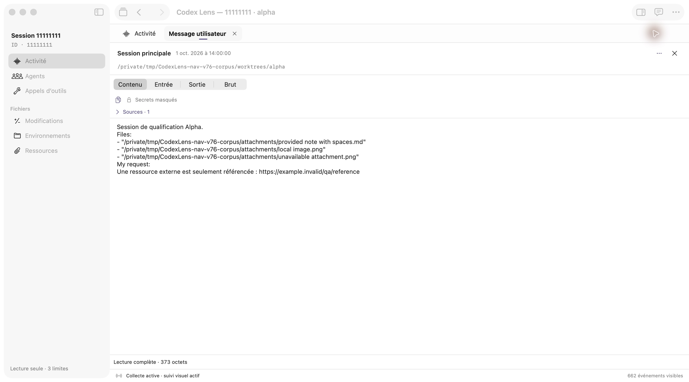

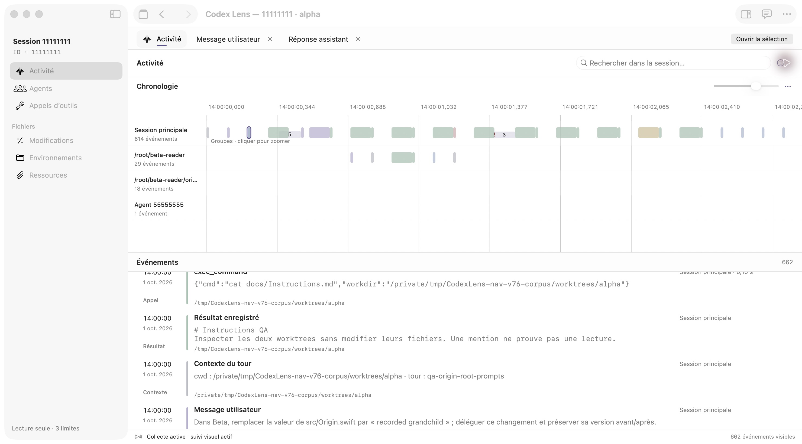

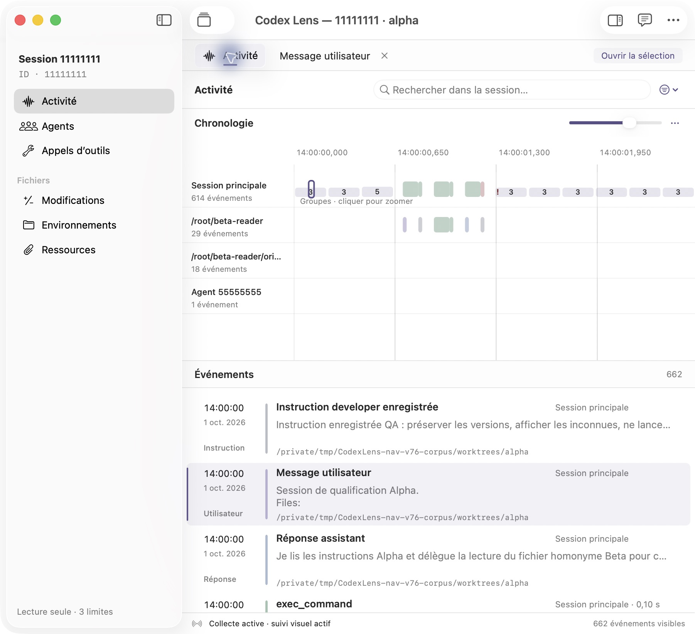

Capture identities, hashes and exclusions are in the [manifest](../images/navigation/capture-manifest.json). Captures involving a relaunch or stale application binding were excluded.

The added **WorkspaceSceneV76Main** regression passed **24 assertions** through two real SwiftUI scenes using the production window wrapper, commands and `openWindow` handler. It verified distinct stable native toolbar identifiers, the selected message in the child, the parent's selection and 19.6×/pan position, both windows' loading transitions, key-window command availability, shared-reader identity and unchanged fixture files. This run preceded only the subsequent earliest-event lower-bound correction; it is not described as a fresh post-correction scene run. Production cleanup stopped both observers and unregistered both windows. The probe did not finish its native termination request within the launcher's three-second allowance; the launcher stopped only its own process. Native application quit is therefore unqualified separately from these successful scene assertions.

```sh
zsh scripts/verify-design-v07.sh --source-root "$PWD" --output /private/tmp/lens-scene-check --corpus /private/tmp/lens-navigation-corpus --entrypoint WorkspaceSceneV76Main.swift --after-source-freeze --run
```

### Same-process production window replay after toolbar isolation

The final production-source QA replay used commit **`75ba2478c011d91c11760a841f40fbfdd4abb71d`**, app **0.41.0/build 75**, Mach-O UUID **`8D7703F7-9807-364B-9266-0A832EF8DC10`**. The exact owned QA process remained **PID 29452** before and after the selected-item new-window action; there was no crash or relaunch. This resolves the previously blocked post-toolbar-isolation inspection. It does not qualify the later edge correction.

The reviewer selected the supplied root user message `qa-user-supplied`, used **File → Open in a new window**, and inspected the resulting child. The native Window menu contained **two actual session windows**. The child displayed the selected user's complete message with its own reader identity. Returning through the native Window menu preserved the parent's user-message selection, **19.6×** timeline zoom, independently scrolled **rows 3–7**, and parent reader. Selecting an assistant event in the child's Activity changed only the child and retained its explicit user-message reader.

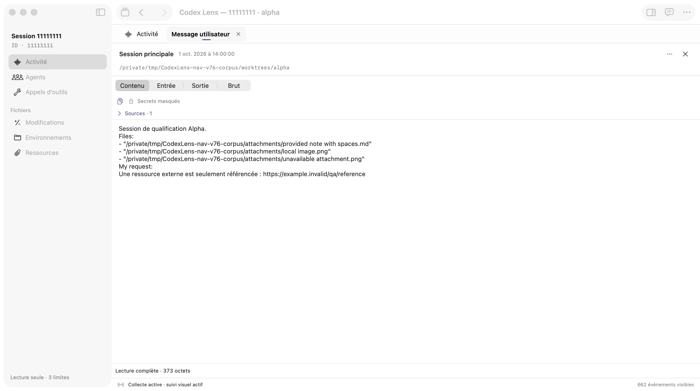

*The child opens the complete supplied message. This capture belongs to the toolbar-isolated build before the subsequent first-event focus correction; it is not a screenshot of that correction.*

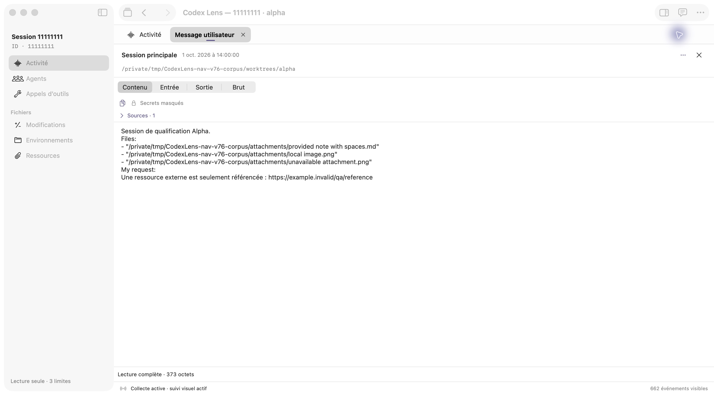

Back in the same parent retained the selection, zoom and list reading range. The saved scrollbar fractions differed slightly as the reader tab strip changed viewport height; the visible list anchor remained the same. The child-close attempt was interrupted when the Mac locked. **Child close and return to the parent after that close remain unconfirmed.** No unlock bypass was attempted. The primary agent subsequently stopped only the exact owned QA process 29452.

### N6 — first-event focus reveals an invalid leading gap

This replay exposed a further **major** defect. From the unchanged Activity layout, the reviewer clicked the first root group (**29 events, 14:00:00–14:00:02**), then the earliest user event at source line 3. Its initial **19.6×** framing left a large blank region before the timeline lanes. No manual pan, fit, filter, selected-period, divider, window-size or appearance operation occurred. The reviewer then scrolled only the list, opened the selected message, and used toolbar Back in the same parent/window geometry. Back normalized the timeline's left edge while preserving the selected user message, zoom and list range.

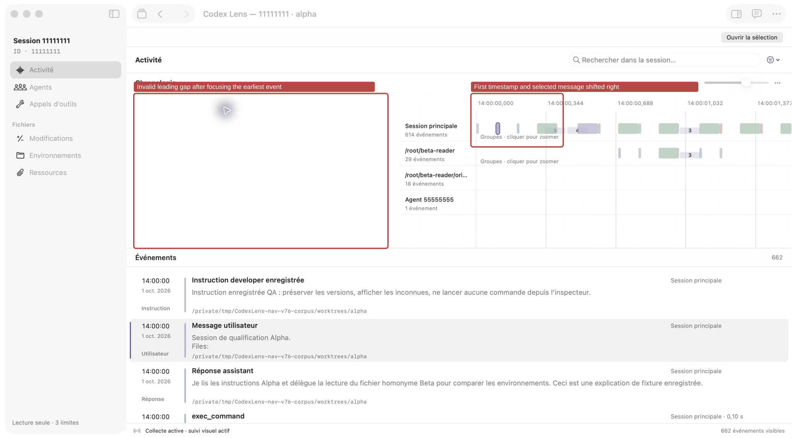

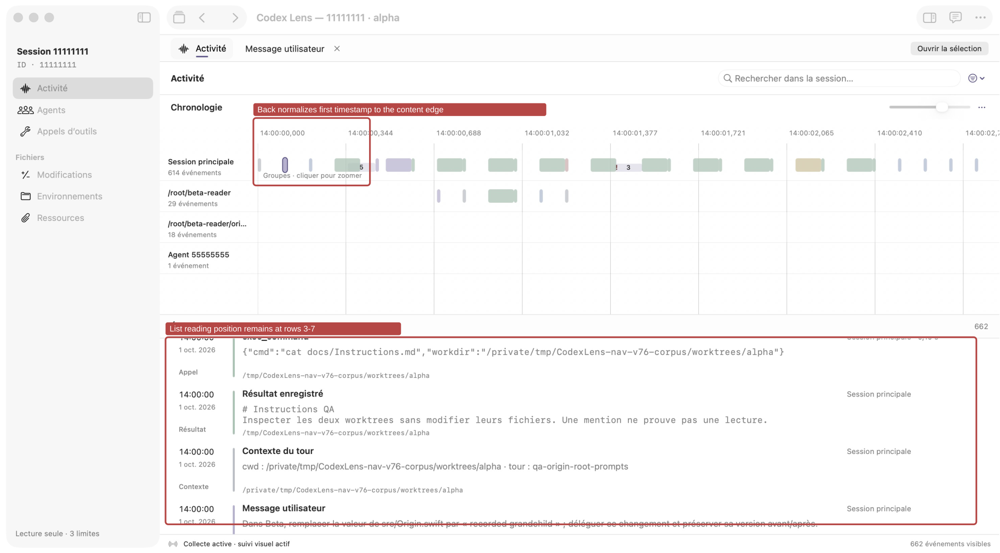

*Both annotations preserve the original embedded JPEG bytes. The second image shows a return-path normalization in the same pre-correction build, not a post-fix comparison.*

`TimelineCanvas.reveal` bounded the centered X position above but could allow a negative lower position near the first event. The follow-up correction clamps that position to zero as well. The latest **76/76** native assertions include first/last-edge scenarios under overlay and legacy scrollers and retain the prior return checks. **Manual inspection of the corrected first-edge behavior remains blocked by the locked Mac.** Last-window close, physical trackpad input, VoiceOver, and final appearance rechecks were not qualified by this final replay.

The exact captured source revision's [CI run](https://github.com/wolf75222/CodexLens/actions/runs/37420547595) passed. The follow-up edge correction is a later source change; that result is not presented as its CI result. The primary agent will verify CI on the final committed revision separately. Temporary crash-diagnostic logging was removed from the app.

The [capture manifest](../images/navigation/capture-manifest.json) records file hashes, the captured source/UUID, unchanged-pixel annotation checks, same-process window results, and the remaining inspection boundary. Earlier valid screenshots are retained with their original scopes.
